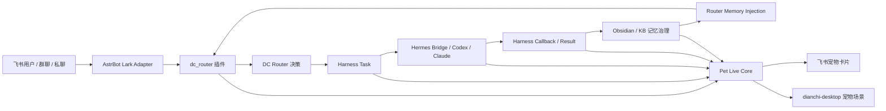

# 「活系统」之宠物系统 Codex 开发计划

> **For agentic workers:** REQUIRED SUB-SKILL: Use `superpowers:subagent-driven-development` to execute this plan.

**Goal:** 在 `feature/live-pet-system` 分支上落地一套牢固的宠物活系统底座，使飞书、AstrBot、DC Router、Harness、Hermes、Obsidian/知识库、桌面端之间形成可追踪闭环。宠物表现层必须建立在身份、事件、任务、记忆、反馈的稳定链路上，而不是孤立 UI。

**Architecture:** 以 `Pet Live Core` 作为统一状态层，向上接飞书/AstrBot 事件入口，横向接 Router/Harness/Hermes 执行链路，向下写入 SQLite/事件 outbox/Obsidian 治理记忆，向外提供 `/api/pet/*` 给 `dianchi-desktop` 和飞书卡片读取。

**Tech Stack:** Python、SQLite、AstrBot 插件、DC Router、Harness Engine、Hermes Bridge、ObsidianVault、Knowledge Base、PySide6、React/Vite。

---

## 一、开发原则

这条分支先做“底座闭环”，再做“桌宠好看”。

不可妥协的三条规则：

1. **不做第二只宠物**：飞书 `/pet`、桌面端、任务系统看到的必须是同一个 `pet_id`。
2. **不做前端自嗨状态**：宠物状态由服务端 reducer 统一生成，桌面端和飞书卡片只消费状态。
3. **不跳过业务链路**：宠物的成长、情绪、动作必须来自飞书/AstrBot/Router/Harness/Hermes/Obsidian 的真实事件。

---

## 二、闭环总链路



闭环定义：

| 环节 | 输入 | 输出 | 宠物系统记录 |
|---|---|---|---|
| 飞书入口 | 员工消息、卡片动作 | AstrBot event | `feishu_message_received` / `pet_card_action` |
| AstrBot | 平台事件、sender open_id | 插件分发 | `astrbot_event_seen` |
| Router | 文本、上下文、记忆 | intent、provider、route decision | `router_decision_made` |
| Harness | router decision、任务 payload | task_id、状态机 | `harness_task_created` / `harness_task_status_changed` |
| Hermes | task request | running/completed/failed callback | `hermes_task_running` / `hermes_task_completed` / `hermes_task_failed` |
| Obsidian/KB | 结果、证据、人工审核 | governed memory、KB refs | `memory_promoted` / `obsidian_note_linked` |
| Router 记忆注入 | query、approved memory | extras/context | `memory_context_injected` |
| 宠物表现 | live state | 飞书卡片、桌面动画 | `pet_state_rendered` |

---

## 三、真实代码落点

### 3.1 飞书 / AstrBot

| 能力 | 当前文件 | 本分支要做 |
|---|---|---|
| 飞书宠物入口 | `data/plugins/feishu_pet_assistant/main.py` | `/pet`、`/done`、卡片动作写入 Pet Live Core |
| 飞书卡片发送 | `dc_engines/dc_engines/feishu_card_streamer/` | 宠物卡片展示 live state 和桌面入口 |
| 飞书资料读取 | `dc_engines/dc_engines/feishu_reader/` | 后续把“资料查询成功/失败”写成宠物事件 |
| 飞书资源插件 | `data/plugins/feishu_resource_plugin/main.py` | 查询/归档动作进入任务和记忆闭环 |

### 3.2 Router

| 能力 | 当前文件 | 本分支要做 |
|---|---|---|
| 路由总管线 | `data/plugins/dc_router/dispatch.py` | 在关键 stage 增加 Pet event tap，不改变 stop 语义 |
| 决策应用 | `data/plugins/dc_router/routing/apply_decision.py` | route decision 写 `router_decision_made` |
| 事件 envelope | `data/plugins/dc_router/routing/event_envelope.py` | 统一带 `conversation_id`、`platform_id`、`sender_id` |
| 记忆注入 | `data/plugins/dc_router/memory_injection.py` | 记忆命中写 `memory_context_injected` |

### 3.3 Harness

| 能力 | 当前文件 | 本分支要做 |
|---|---|---|
| 任务生命周期 | `dc_engines/dc_engines/harness/engine.py` | create/status/complete/fail 都发布 Pet events |
| 任务 store | `dc_engines/dc_engines/harness/task_store.py` | 关联 `pet_id`、`conversation_id`、`source_event_id` |
| 顶层 harness | `harness/task_state.py`、`harness/queue_store.py` | 对齐任务状态事件命名 |
| 合约 | `harness/contracts/*.json` | 新增 `pet_live_system.json` 合约 |

### 3.4 Hermes

| 能力 | 当前文件 | 本分支要做 |
|---|---|---|
| 深度任务桥 | `harness/hermes_bridge.py` | running/completed/failed callback 转宠物事件 |
| AstrBot 插件桥 | `data/plugins/hermes_bridge/hermes_bridge.py` | 回群结果绑定 pet/harness task |
| Runtime Registry | `harness/runtime_registry.py` | runtime 信息进入 payload，宠物可展示“谁在工作” |

### 3.5 Obsidian / KB

| 能力 | 当前文件 | 本分支要做 |
|---|---|---|
| Obsidian Vault | `ObsidianVault/` | 宠物任务成果可链接到治理笔记 |
| 记忆治理 codec | `dc_engines/dc_engines/memory_governance/obsidian_codec.py` | 给宠物记忆增加 `source_system=pet_live` 支持 |
| 治理脚本 | `scripts-tools/obsidian_memory_governance.py` | 支持 pet/harness 结果进入审核队列 |
| KB 数据库 | `data/knowledge_base/kb.db` | 宠物事件只存引用，不复制大段内容 |
| 合约测试 | `tests/harness/test_obsidian_memory_governance_contract.py` | 增加 pet source 回归 |

### 3.6 桌面端

| 能力 | 当前文件 | 本分支要做 |
|---|---|---|
| API 客户端 | `/Users/dianchi/dianchi-desktop/src/api_client.py` | 增加 `/api/pet/*` |
| 主窗口 | `/Users/dianchi/dianchi-desktop/src/main_window.py` | 增加宠物栏和场景入口 |
| WebView/Profile | `/Users/dianchi/dianchi-desktop/src/shared_profile.py`、`src/feishu_view.py` | 复用登录态，不另建身份 |
| 宠物运行时 | 新增 `src/pet_runtime.py` | 状态缓存、事件游标、心跳、断线恢复 |

---

## 四、P0 底座设计

### 4.1 新增核心模块

新增：

```text
DC-Agent/
  dc_engines/dc_engines/pet_live/
    __init__.py
    contracts.py
    identity.py
    event_bus.py
    reducer.py
    store.py
    service.py
    integrations.py
    obsidian_bridge.py
```

职责：

| 文件 | 责任 |
|---|---|
| `contracts.py` | 定义 `PetIdentity`、`PetEvent`、`PetState`、`PetSourceRef` |
| `identity.py` | 绑定飞书 open_id、employee_id、desktop_session、pet_id |
| `event_bus.py` | 提供轻量 publish API，供 Router/Harness/Hermes 调用 |
| `reducer.py` | 唯一状态机，事件进入后推导宠物状态 |
| `store.py` | SQLite migrations、outbox、state snapshot、source refs |
| `service.py` | 面向插件/API 的用例层 |
| `integrations.py` | Router/Harness/Hermes 的 adapter helpers |
| `obsidian_bridge.py` | 任务成果到 Obsidian/KB 的引用桥接 |

### 4.2 核心事件表

新增 `pet_event_outbox`：

```sql
CREATE TABLE IF NOT EXISTS pet_event_outbox (
  id INTEGER PRIMARY KEY AUTOINCREMENT,
  pet_id TEXT NOT NULL,
  user_id TEXT NOT NULL,
  source TEXT NOT NULL,
  event_type TEXT NOT NULL,
  source_ref_json TEXT NOT NULL,
  payload_json TEXT NOT NULL,
  state_before_json TEXT,
  state_after_json TEXT,
  created_at TEXT NOT NULL
);
```

`source_ref_json` 必须能回到原始业务来源：

```json
{
  "platform": "lark",
  "conversation_id": "oc_xxx",
  "message_id": "om_xxx",
  "router_trace_id": "router_xxx",
  "harness_task_id": "task_xxx",
  "hermes_job_id": "job_xxx",
  "obsidian_note_path": "ObsidianVault/...",
  "kb_doc_id": "kb_xxx"
}
```

### 4.3 状态 reducer

第一批状态：

| 事件 | 宠物状态 | 业务含义 |
|---|---|---|
| `feishu_message_received` | `waiting` | 员工发起互动 |
| `router_decision_made` | `thinking` | 系统理解意图 |
| `harness_task_created` | `working` | 任务进入生命周期 |
| `hermes_task_running` | `working` | 深度执行中 |
| `hermes_task_completed` | `success` | 执行完成 |
| `harness_task_review_required` | `review` | 等待人工审核 |
| `harness_task_failed` | `failed` | 任务失败 |
| `memory_promoted` | `happy` | 成果沉淀为记忆 |
| `memory_context_injected` | `focused` | 记忆反哺本轮回答 |

---

## 五、Codex 执行阶段

### Phase 0：分支和基线，0.5 天

- [ ] 在 `DC-Agent` 创建 `feature/live-pet-system`。
- [ ] 在 `dianchi-desktop` 创建 `feature/live-pet-system`。
- [ ] 记录当前 `data/feishu_pet.db` schema。
- [ ] 跑现有宠物测试。
- [ ] 跑 Router/Harness/Obsidian 相关关键测试。

命令：

```bash
git -C /Users/dianchi/DC-Agent switch -c feature/live-pet-system
git -C /Users/dianchi/dianchi-desktop switch -c feature/live-pet-system
uv run pytest tests/test_feishu_pet_assistant.py tests/harness/test_obsidian_memory_governance_contract.py -q
```

验收：

- [ ] 分支创建完成。
- [ ] 现有宠物测试通过。
- [ ] Obsidian governance 合约测试通过。

### Phase 1：Pet Live Core，1 天

- [ ] 新增 `dc_engines/dc_engines/pet_live/contracts.py`。
- [ ] 新增 `identity.py`，实现 `get_or_create_identity(feishu_open_id, employee_id=None, desktop_session_id=None)`。
- [ ] 新增 `store.py`，实现 migrations。
- [ ] 新增 `event_bus.py`，实现 `publish_pet_event(...)`。
- [ ] 新增 `reducer.py`，实现状态机。
- [ ] 新增 `service.py`，提供 `record_event()`、`get_pet_state()`、`list_events_after()`。
- [ ] 新增单测：
  - `tests/test_pet_live_identity.py`
  - `tests/test_pet_live_event_bus.py`
  - `tests/test_pet_live_reducer.py`
  - `tests/test_pet_live_store.py`

验收：

```bash
uv run pytest tests/test_pet_live_identity.py tests/test_pet_live_event_bus.py tests/test_pet_live_reducer.py tests/test_pet_live_store.py -q
```

### Phase 2：飞书 / AstrBot 接入，1 天

- [ ] 修改 `data/plugins/feishu_pet_assistant/main.py`。
- [ ] `/pet` 写 `pet_card_viewed`。
- [ ] `/done` 写 `task_completed`。
- [ ] 卡片按钮写 `pet_card_action`。
- [ ] 从 event 提取 `platform_id`、`chat_id`、`message_id`、`sender_id`，写入 `source_ref_json`。
- [ ] 保留 fallback 文本，不破坏非飞书平台。

验收：

```bash
uv run pytest tests/test_feishu_pet_assistant.py tests/test_pet_live_event_bus.py -q
```

### Phase 3：Router 事件 tap，1 天

- [ ] 在 `data/plugins/dc_router/dispatch.py` 增加低侵入 event tap。
- [ ] Router 收到飞书消息时写 `feishu_message_received`。
- [ ] `apply_decision` 后写 `router_decision_made`。
- [ ] memory injection 成功时写 `memory_context_injected`。
- [ ] 任何 tap 失败只能记录 warning，不能中断 Router 主流程。
- [ ] 新增 `tests/dc_router/test_pet_live_tap.py`。

验收：

```bash
uv run pytest tests/dc_router/test_pet_live_tap.py tests/dc_router/test_dispatch_pipeline.py -q
```

### Phase 4：Harness 生命周期接入，1 天

- [ ] 在 `dc_engines/dc_engines/harness/engine.py` 的 create/status/complete/fail 流程发布宠物事件。
- [ ] `create_task` 写 `harness_task_created`。
- [ ] `mark_in_progress` 写 `harness_task_in_progress`。
- [ ] `mark_review_required` 写 `harness_task_review_required`。
- [ ] `complete_task` 写 `harness_task_completed`。
- [ ] `fail_task` 写 `harness_task_failed`。
- [ ] 所有事件带 `harness_task_id`。
- [ ] 新增 `tests/harness/test_pet_live_harness_events.py`。

验收：

```bash
uv run pytest tests/harness/test_pet_live_harness_events.py dc_engines/tests/test_harness_engine.py -q
```

### Phase 5：Hermes Bridge 接入，1 天

- [ ] 在 `harness/hermes_bridge.py` 的 `_notify_running` 写 `hermes_task_running`。
- [ ] `_finish_completed` 成功后写 `hermes_task_completed`。
- [ ] `_finish_failed` 写 `hermes_task_failed`。
- [ ] payload 带 `runtime`、`queue_job_id`、`session_id`。
- [ ] `data/plugins/hermes_bridge/hermes_bridge.py` 回群成功后写 `assistant_response_sent`。
- [ ] 新增 `tests/harness/test_pet_live_hermes_bridge.py`。

验收：

```bash
uv run pytest tests/harness/test_pet_live_hermes_bridge.py -q
```

### Phase 6：Obsidian / KB 闭环，1-2 天

- [ ] 新增 `pet_live/obsidian_bridge.py`。
- [ ] Harness completed 且满足记忆晋升条件时写 `memory_promotion_candidate`。
- [ ] Obsidian 治理 note 生成后写 `obsidian_note_linked`。
- [ ] 人工 approved 后写 `memory_promoted`。
- [ ] Router 后续检索到该记忆时写 `memory_context_injected`。
- [ ] 只存 note path / kb doc id / source hash，不在宠物事件里复制全文。
- [ ] 新增 `harness/contracts/pet_live_system.json`。
- [ ] 新增 `tests/harness/test_pet_live_obsidian_loop.py`。

验收：

```bash
uv run pytest tests/harness/test_pet_live_obsidian_loop.py tests/harness/test_obsidian_memory_governance_contract.py tests/unit/test_kb_source_citations.py -q
```

闭环验收：

1. Hermes 完成任务。
2. Harness 结果进入 Obsidian governance note。
3. 人工批准后进入 KB/记忆。
4. 下一次相关飞书提问时 Router 注入该记忆。
5. 宠物状态从 `working` → `success` → `happy` → `focused`。

### Phase 7：Pet API，1 天

- [ ] 新增 `/api/pet/me`。
- [ ] 新增 `/api/pet/events?after_id=`。
- [ ] 新增 `/api/pet/heartbeat`。
- [ ] 新增 `/api/pet/actions`。
- [ ] API 鉴权只信任 `dc_feishu_session`，不信任前端传 user_id。
- [ ] 新增 `tests/test_pet_live_route.py`。

验收：

```bash
uv run pytest tests/test_pet_live_route.py tests/test_pet_live_store.py -q
```

### Phase 8：桌面端状态底座，1 天

- [ ] 修改 `/Users/dianchi/dianchi-desktop/src/api_client.py`，增加宠物 API。
- [ ] 新增 `src/pet_state.py`。
- [ ] 新增 `src/pet_live_client.py`。
- [ ] 新增 `src/pet_runtime.py`。
- [ ] 实现 `last_event_id` 本地缓存。
- [ ] 实现心跳和断线恢复。

验收：

```bash
python -m py_compile \
  /Users/dianchi/dianchi-desktop/src/api_client.py \
  /Users/dianchi/dianchi-desktop/src/pet_state.py \
  /Users/dianchi/dianchi-desktop/src/pet_live_client.py \
  /Users/dianchi/dianchi-desktop/src/pet_runtime.py
```

### Phase 9：宠物场景首版，2-3 天

- [ ] 新增 `/Users/dianchi/dianchi-desktop/src/pet_scene_view.py`。
- [ ] 新增 `/Users/dianchi/dianchi-desktop/pet-scene/`。
- [ ] 支持 `pet.json` + `spritesheet.webp`。
- [ ] 支持状态：`idle`、`waiting`、`thinking`、`working`、`success`、`failed`、`review`、`happy`、`focused`。
- [ ] 桌面右侧宠物栏读取 `PetRuntime`。
- [ ] 不在前端自行改变业务状态，只播放服务端状态。

验收：

- [ ] 桌面启动能看到宠物。
- [ ] 飞书发消息后 3 秒内进入 `waiting` 或 `thinking`。
- [ ] Hermes 执行时进入 `working`。
- [ ] 任务完成后进入 `success`。
- [ ] 记忆命中后进入 `focused`。

### Phase 10：端到端灰度，1 天

- [ ] 增加 `PET_LIVE_ENABLED`。
- [ ] 增加 `PET_LIVE_TAP_ENABLED`。
- [ ] 增加 `DIANCHI_PET_SCENE_ENABLED`。
- [ ] 配置灰度用户白名单。
- [ ] 记录事件量、API 错误、桌面心跳、状态转移失败。
- [ ] 写灰度验收记录。

验收：

```bash
uv run pytest tests/test_feishu_pet_assistant.py tests/test_pet_live_* tests/dc_router/test_pet_live_tap.py tests/harness/test_pet_live_* -q
```

---

## 六、合约文件

新增：

```text
harness/contracts/pet_live_system.json
```

合约字段：

| 字段 | 说明 |
|---|---|
| `contract_id` | `pet_live_system` |
| `version` | `0.1.0` |
| `sources` | `feishu`、`astrbot`、`router`、`harness`、`hermes`、`obsidian`、`desktop` |
| `required_identity_keys` | `feishu_open_id`、`pet_id` |
| `optional_identity_keys` | `employee_id`、`desktop_session_id` |
| `required_events` | P0 事件枚举 |
| `source_ref_required_keys` | 每类来源必须带的追踪字段 |
| `privacy_rules` | 禁止在宠物事件复制飞书全文、KB 正文、用户隐私原文 |

---

## 七、观测与排障

新增基础观测：

| 指标 | 说明 |
|---|---|
| `pet_events_total` | 事件总量，按 source/event_type 分组 |
| `pet_event_publish_failed_total` | event tap 失败次数 |
| `pet_state_transition_failed_total` | reducer 失败次数 |
| `pet_desktop_heartbeat_total` | 桌面端在线心跳 |
| `pet_api_error_total` | `/api/pet/*` 错误 |
| `pet_identity_conflict_total` | 身份冲突 |

日志原则：

1. source_ref 可记录 ID，不记录消息全文。
2. 事件 publish 失败不影响 Router/Harness 主链路。
3. 身份冲突必须 warning，并拒绝返回宠物数据。
4. 所有灰度问题先看 `pet_event_outbox` 是否有完整链路。

---

## 八、回滚策略

配置开关：

| 开关 | 作用 |
|---|---|
| `PET_LIVE_ENABLED=false` | 关闭 Pet Live Core 对外能力 |
| `PET_LIVE_TAP_ENABLED=false` | 关闭 Router/Harness/Hermes 事件 tap |
| `PET_LIVE_API_ENABLED=false` | 关闭 `/api/pet/*` |
| `DIANCHI_PET_SCENE_ENABLED=false` | 桌面端隐藏宠物场景 |

回滚要求：

1. 关闭开关后，原 `/pet` 卡片仍可按旧逻辑工作。
2. Router、Harness、Hermes 不依赖宠物模块才能运行。
3. 事件表只追加不删除，回滚不做 destructive migration。

---

## 九、最终验收剧本

### 剧本 A：飞书任务闭环

1. 员工在飞书对小助手说“帮我整理这个项目的待办”。
2. AstrBot 收到事件。
3. Router 生成 route decision。
4. Harness 创建 task。
5. 宠物进入 `working`。
6. Hermes/Codex 完成结果。
7. 飞书回群。
8. Harness completed。
9. 宠物进入 `success`。
10. 结果进入 Obsidian governance 候选。
11. 批准后进入 KB。
12. 宠物进入 `happy`。

### 剧本 B：记忆反哺闭环

1. 员工再次问相关项目。
2. Router memory injection 命中刚才批准的 Obsidian/KB 记忆。
3. 宠物进入 `focused`。
4. 小助手回复时引用该记忆来源。
5. `/pet` 卡片显示“刚刚使用了已审核项目记忆”。

### 剧本 C：桌面端同步

1. 同一员工打开 `dianchi-desktop`。
2. 桌面端用 `dc_feishu_session` 调 `/api/pet/me`。
3. 返回同一 `pet_id`。
4. 飞书触发新任务。
5. 桌面端轮询 `/api/pet/events`。
6. 宠物动画从 `idle` 切到 `working`。
7. 任务完成后切到 `success`。

---

## 十、完成定义

这份 Codex 开发计划完成时，应满足：

1. `Pet Live Core` 有独立测试。
2. 飞书/AstrBot 入口接入事件流。
3. Router 决策接入事件流。
4. Harness 生命周期接入事件流。
5. Hermes running/completed/failed 接入事件流。
6. Obsidian/KB 形成“结果沉淀”和“记忆反哺”的双向闭环。
7. 桌面端通过 API 消费同一宠物状态。
8. 飞书卡片和桌面宠物展示一致。
9. 所有能力有开关，可灰度，可回滚。

底座完成以后，才进入宠物资产、场景、动画细节的进阶开发。
