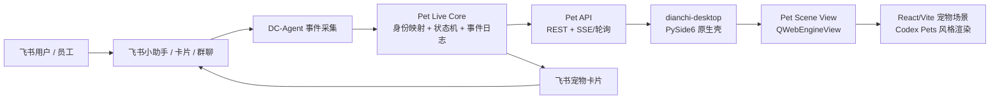

# 「活系统」之宠物系统分支开发全栈方案与落地计划

> **For agentic workers:** REQUIRED SUB-SKILL: Use `superpowers:subagent-driven-development` to execute this plan.

**Goal:** 把现有飞书宠物助手、`dianchi-desktop` 本地客户端、以及 Codex Pets 风格的宠物/场景体验，升级为一个“同一只宠物、同一个身份、同一条事件流”的活系统。员工在飞书里和小助手互动、完成任务、被提醒或收到执行结果时，桌面端宠物要同步呈现对应状态；桌面端不再只是壳，而是小助手的可视化身体。

**Architecture:** 采用“DC-Agent 宠物状态核心 + 飞书事件绑定 + 桌面端宠物运行时 + Web 场景渲染层”的四层架构。飞书小助手继续作为业务入口，DC-Agent 负责身份、状态、事件、任务和持久化，`dianchi-desktop` 负责桌面壳、登录态和可见宠物，React/Vite/Canvas/WebGL 渲染层负责 Codex Pets 风格动画与场景。

**Tech Stack:** Python 3、SQLite、AstrBot/DC-Agent 插件、PySide6、QWebEngineView、React/Vite/TypeScript、WebSocket/SSE 或短轮询、Codex Pets 兼容宠物包格式。

---

## 一、结论

可以升级，而且应该按“活系统”做，不应该只做一个漂亮桌宠皮肤。

这次分支的核心不是“给桌面端加一个宠物窗口”，而是把现有三件东西打通：

| 现有资产 | 当前位置 | 在活系统里的角色 |
|---|---|---|
| 飞书宠物助手 MVP | `DC-Agent/data/plugins/feishu_pet_assistant/` | 业务入口、任务闭环、宠物卡片 |
| 宠物 SQLite | `DC-Agent/data/feishu_pet.db` | 现有宠物状态和任务事件种子 |
| 本地客户端 | `/Users/dianchi/dianchi-desktop` | 登录态、飞书 WebView、桌面宠物容器 |
| Codex Pets 参考项目 | `portons/codex-pet-share` / `codex-pets.net` | 宠物包格式、动画状态、场景交互参考 |

最终形态：

1. 飞书里 `/pet` 看到的宠物，和桌面端看到的是同一只。
2. 员工和飞书小助手聊天，桌面端宠物会进入 `waiting`、`working`、`success`、`failed`、`review` 等状态。
3. 员工完成任务、被提醒、触发 Hermes/Codex 执行、收到总结时，宠物经验、能量、心情、场景都会变化。
4. 宠物不是装饰层，而是 DC-Agent 对员工工作状态、任务反馈、陪伴体验的可视化代理。

---

## 二、当前基线

### 2.1 DC-Agent 侧已经有的能力

`feishu_pet_assistant` 插件当前已经落地了 P0：

| 文件 | 当前能力 |
|---|---|
| `data/plugins/feishu_pet_assistant/main.py` | `/pet`、`/tasks`、`/done 1`、飞书卡片按钮路由 |
| `data/plugins/feishu_pet_assistant/service.py` | 创建宠物、列任务、完成任务、喂养、统计状态 |
| `data/plugins/feishu_pet_assistant/store.py` | SQLite 表 `pets`、`pet_tasks`、`pet_events` |
| `data/plugins/feishu_pet_assistant/cards.py` | 飞书状态卡、任务卡、完成卡 |
| `tests/test_feishu_pet_assistant.py` | 插件已有单元测试入口 |

当前问题：

1. 宠物只在飞书卡片里“被查看”，没有成为实时状态层。
2. `pet_events` 是日志，不是可被桌面端消费的状态事件流。
3. `user_id` 以飞书 sender open_id 为主，但还没有和桌面 session、员工目录、聊天助手身份统一建模。
4. 桌面端没有宠物运行时，也没有宠物状态订阅能力。

### 2.2 桌面端已经有的能力

`/Users/dianchi/dianchi-desktop` 已经由 Claude Code 修改成更接近真实桌面客户端：

| 文件 | 当前能力 |
|---|---|
| `src/app.py` | `dianchi://` 协议、QApplication 启动前环境处理 |
| `src/shared_profile.py` | QWebEngineProfile 持久化、Cookie/Profile 复用 |
| `src/feishu_view.py` | 飞书 Messenger WebView、弹窗/导航处理 |
| `src/api_client.py` | `dc_feishu_session`、`/api/me`、钱包、商店、会话、消息接口 |
| `src/main_window.py` | 本地客户端主窗口和 workspace UI |

当前问题：

1. 桌面端已经能承载 WebView，但还没有“宠物场景视图”。
2. `ApiClient` 没有宠物 API。
3. 桌面端登录态还没有与飞书 sender open_id 显式绑定到宠物身份。
4. 没有本地状态缓存、断线恢复、宠物动画状态机。

### 2.3 Codex Pets 参考价值

Codex Pets 的参考点不是直接照搬后端，而是采用它的产品结构：

| 参考点 | 应用方式 |
|---|---|
| 宠物包 | `pet.json` + `spritesheet.webp` + preview/share assets |
| 动画状态 | `idle`、`running`、`waiting`、`failed`、`review` 等映射到工作事件 |
| Playground | 多宠物、多场景、可交互、可分享 |
| Provider Adapter | 把存储、实时、资产发布抽象出来，避免绑定单一云厂商 |

本项目不需要第一阶段就上 Cloudflare D1/R2/Durable Objects。第一阶段应先在 DC-Agent/桌面端内跑通身份、事件和状态，后续再把资产分发、多人场景、云同步抽出来。

---

## 三、目标架构



关键原则：

1. **同一身份**：飞书 open_id、员工目录 employee_id、桌面 session、pet_id 统一映射。
2. **同一事件流**：飞书消息、卡片动作、任务完成、Hermes/Codex 状态都写入 `pet_event_outbox`。
3. **同一状态机**：所有展示层只读状态，不各自推导宠物心情。
4. **双端展示**：飞书卡片适合轻量反馈，桌面端适合持续陪伴和复杂场景。
5. **渐进实时**：MVP 先轮询，稳定后升级 SSE/WebSocket。

---

## 四、分支策略

建议新建独立开发分支：

```bash
git -C /Users/dianchi/DC-Agent switch -c feature/live-pet-system
git -C /Users/dianchi/dianchi-desktop switch -c feature/live-pet-system
```

如果两个仓库需要并行推进，建议按以下提交边界拆分：

| 提交 | 仓库 | 内容 |
|---|---|---|
| 1 | `DC-Agent` | `pet_live` 数据模型、事件 reducer、迁移 |
| 2 | `DC-Agent` | 飞书插件接入事件流 |
| 3 | `DC-Agent` | 宠物 REST API / SSE 或轮询接口 |
| 4 | `dianchi-desktop` | `ApiClient` 增加宠物接口和状态缓存 |
| 5 | `dianchi-desktop` | 宠物场景容器和 PySide6 集成 |
| 6 | `dianchi-desktop` | React/Vite 宠物场景首版 |
| 7 | 双仓 | 端到端联调、灰度开关、文档和验收记录 |

---

## 五、数据模型

### 5.1 身份映射

新增表：`pet_identity_links`

| 字段 | 类型 | 说明 |
|---|---|---|
| `pet_id` | TEXT PRIMARY KEY | 宠物全局 ID，例如 `pet_...` |
| `feishu_open_id` | TEXT UNIQUE NOT NULL | 飞书 sender open_id |
| `employee_id` | TEXT | 员工目录 ID，可后补 |
| `desktop_session_id` | TEXT | `dc_feishu_session` 对应的桌面会话 |
| `created_at` | TEXT | 创建时间 |
| `updated_at` | TEXT | 更新时间 |

### 5.2 宠物档案

在现有 `pets` 表基础上迁移或新增兼容字段：

| 字段 | 类型 | 说明 |
|---|---|---|
| `pet_id` | TEXT | 与 identity link 绑定 |
| `user_id` | TEXT | 兼容现有飞书 open_id |
| `pet_name` | TEXT | 宠物名 |
| `species` | TEXT | 宠物类型，例如 `orange-cat` |
| `asset_id` | TEXT | 当前宠物包 ID |
| `state` | TEXT | `idle` / `waiting` / `working` / `success` / `failed` / `review` / `sleeping` |
| `emotion` | TEXT | `calm` / `happy` / `tired` / `focused` / `worried` |
| `scene` | TEXT | 当前场景，例如 `desk` / `garden` / `night-room` |
| `level` | INTEGER | 等级 |
| `xp` | INTEGER | 经验 |
| `coins` | INTEGER | 金币或积分 |
| `energy` | INTEGER | 沿用当前能量 |
| `streak_days` | INTEGER | 沿用当前连续天数 |
| `last_event_id` | INTEGER | 最近事件 |
| `last_active_at` | TEXT | 最近活跃时间 |

### 5.3 事件流

新增表：`pet_event_outbox`

| 字段 | 类型 | 说明 |
|---|---|---|
| `id` | INTEGER PRIMARY KEY AUTOINCREMENT | 桌面端游标 |
| `pet_id` | TEXT NOT NULL | 宠物 ID |
| `user_id` | TEXT NOT NULL | 兼容现有 open_id |
| `event_type` | TEXT NOT NULL | 事件类型 |
| `source` | TEXT NOT NULL | `feishu` / `desktop` / `hermes` / `codex` / `system` |
| `payload_json` | TEXT NOT NULL | 结构化 payload |
| `state_before_json` | TEXT | reducer 前状态 |
| `state_after_json` | TEXT | reducer 后状态 |
| `created_at` | TEXT NOT NULL | 事件时间 |
| `consumed_at` | TEXT | 可选，服务端消费标记 |

事件类型第一批：

| 事件 | 触发来源 | 状态变化 |
|---|---|---|
| `assistant_message_received` | 飞书私聊/群聊 | `waiting` |
| `assistant_thinking_started` | Router/Hermes/Codex 开始执行 | `working` |
| `assistant_response_sent` | 小助手回复成功 | `success` 或 `happy` |
| `assistant_response_failed` | 执行失败 | `failed` |
| `task_created` | 任务抽取/导入 | `waiting`，增加待办提示 |
| `task_completed` | `/done` 或卡片按钮 | `success`，`energy + xp + coins` |
| `pet_fed` | 喂养/奖励 | `happy`，`energy +` |
| `desktop_heartbeat` | 桌面端在线 | 更新 `last_active_at` |
| `idle_timeout` | 系统定时 | `sleeping` |

### 5.4 资产包

新增表：`pet_assets`

| 字段 | 类型 | 说明 |
|---|---|---|
| `asset_id` | TEXT PRIMARY KEY | 资产包 ID |
| `name` | TEXT | 显示名 |
| `version` | TEXT | 版本 |
| `manifest_json` | TEXT | `pet.json` |
| `local_path` | TEXT | 本地路径 |
| `remote_url` | TEXT | 远程下载地址 |
| `license` | TEXT | 授权 |
| `created_at` | TEXT | 创建时间 |

宠物包目录建议：

```text
assets/pets/orange-cat/
  pet.json
  spritesheet.webp
  preview.webp
  share.png
```

---

## 六、接口契约

第一阶段建议走现有 `dianchi` 服务 API；如果 DC-Agent 暂时没有稳定 HTTP route，则以 `dianchi` 服务作为桌面端入口，DC-Agent 通过内部写库/事件上报保持同步。

### 6.1 获取当前宠物

```http
GET /api/pet/me
Cookie: dc_feishu_session=...
```

返回：

```json
{
  "pet": {
    "pet_id": "pet_01J...",
    "name": "小橘",
    "species": "orange-cat",
    "asset_id": "orange-cat-v1",
    "state": "working",
    "emotion": "focused",
    "scene": "desk",
    "level": 3,
    "xp": 240,
    "coins": 18,
    "energy": 92,
    "streak_days": 4,
    "updated_at": "2026-06-15T12:00:00+08:00"
  },
  "tasks": {
    "pending": 2,
    "done_today": 3
  },
  "last_event_id": 128
}
```

### 6.2 获取事件增量

```http
GET /api/pet/events?after_id=128
Cookie: dc_feishu_session=...
```

返回：

```json
{
  "events": [
    {
      "id": 129,
      "pet_id": "pet_01J...",
      "event_type": "assistant_response_sent",
      "source": "feishu",
      "payload": {
        "conversation_id": "oc_...",
        "summary": "已回复员工问题"
      },
      "state_after": {
        "state": "success",
        "emotion": "happy",
        "energy": 94
      },
      "created_at": "2026-06-15T12:00:08+08:00"
    }
  ],
  "last_event_id": 129
}
```

### 6.3 桌面心跳

```http
POST /api/pet/heartbeat
Cookie: dc_feishu_session=...
Content-Type: application/json

{
  "desktop_session_id": "desktop_...",
  "last_event_id": 129,
  "app_version": "0.1.0"
}
```

### 6.4 宠物动作

```http
POST /api/pet/actions
Cookie: dc_feishu_session=...
Content-Type: application/json

{
  "action": "feed",
  "payload": {
    "item_id": "coffee"
  }
}
```

---

## 七、模块落点

### 7.1 DC-Agent 新增模块

建议新增：

```text
DC-Agent/
  dc_engines/dc_engines/pet_live/
    __init__.py
    contracts.py
    identity.py
    reducer.py
    store.py
    service.py
    api_contracts.py
  tests/
    test_pet_live_identity.py
    test_pet_live_reducer.py
    test_pet_live_store.py
```

职责：

| 文件 | 职责 |
|---|---|
| `contracts.py` | `PetState`、`PetEvent`、`PetIdentity` dataclass / TypedDict |
| `identity.py` | open_id、employee_id、desktop_session_id 绑定 |
| `reducer.py` | 事件到状态的唯一推导逻辑 |
| `store.py` | SQLite migration、事件 outbox、状态快照 |
| `service.py` | 对飞书插件/API 暴露业务方法 |
| `api_contracts.py` | REST payload schema，供桌面端对齐 |

### 7.2 飞书宠物插件改造

修改：

```text
DC-Agent/data/plugins/feishu_pet_assistant/
  main.py
  service.py
  store.py
  cards.py
  _conf_schema.json
```

改造点：

1. `/pet` 调用 `pet_live.service.get_or_create_live_pet()`，不再只读旧 `pets`。
2. `/done` 和卡片按钮完成任务时写入 `task_completed` 事件。
3. 收到宠物卡片查看、喂养等动作时写入 `pet_viewed`、`pet_fed`。
4. 卡片显示 `state`、`emotion`、`level`、`xp`、桌面端打开链接。
5. 保留旧字段兼容，迁移期不破坏现有 `/pet` 行为。

### 7.3 DC-Agent / dianchi API 层

根据当前服务入口选择一个最小落点：

```text
DC-Agent/
  astrbot/dashboard/routes/pet_live.py
  tests/test_pet_live_route.py
```

或在 `dianchi` 服务内新增等价 route。无论落在哪个服务，接口路径保持：

```text
/api/pet/me
/api/pet/events
/api/pet/heartbeat
/api/pet/actions
/api/pet/assets/<asset_id>
```

验收标准是 `dianchi-desktop/src/api_client.py` 能用同一个 `dc_feishu_session` 访问。

### 7.4 桌面端新增模块

建议新增：

```text
/Users/dianchi/dianchi-desktop/
  src/pet_live_client.py
  src/pet_runtime.py
  src/pet_scene_view.py
  src/pet_state.py
  src/pet_assets.py
  pet-scene/
    package.json
    index.html
    src/
      main.tsx
      App.tsx
      petManifest.ts
      runtimeBridge.ts
      scene/
```

修改：

```text
/Users/dianchi/dianchi-desktop/src/api_client.py
/Users/dianchi/dianchi-desktop/src/main_window.py
/Users/dianchi/dianchi-desktop/src/config.py
```

职责：

| 文件 | 职责 |
|---|---|
| `pet_live_client.py` | 调用 `/api/pet/*`，处理轮询和错误 |
| `pet_runtime.py` | 桌面端本地状态缓存、事件游标、心跳 |
| `pet_scene_view.py` | PySide6 `QWebEngineView` 容器，注入状态 |
| `pet_state.py` | Python 侧状态模型 |
| `pet_assets.py` | 本地宠物包发现、下载、缓存 |
| `pet-scene/` | React/Vite 渲染层 |

---

## 八、桌面端体验设计

### 8.1 第一阶段布局

桌面端不要做成单独玩具窗口，先接进现有工作台：

| 区域 | 内容 |
|---|---|
| 左侧/顶部 | 现有 workspace / Feishu Messenger 入口 |
| 右侧窄栏 | 宠物状态、能量、今日任务 |
| 中央或浮层 | 宠物场景视图 |
| 托盘/小窗 | 后续支持迷你桌宠模式 |

第一阶段可以先做“工作台右侧活宠物栏”，第二阶段再做透明无边框桌宠。

### 8.2 状态映射

| 业务状态 | 宠物动画 | 说明 |
|---|---|---|
| 无新事件 | `idle` | 日常待机 |
| 收到员工消息 | `waiting` | 看向用户或提示气泡 |
| Hermes/Codex 执行中 | `working` | 敲键盘、跑动、思考 |
| 回复成功 | `success` / `happy` | 跳跃、挥手 |
| 任务完成 | `jumping` / `happy` | 加经验、飘数字 |
| 执行失败 | `failed` | 低落但可恢复 |
| 等待审核 | `review` | 举牌或看文档 |
| 长时间无操作 | `sleeping` | 睡觉/夜间场景 |

### 8.3 宠物包兼容

参考 Codex Pets 的 spritesheet 思路，但本项目可先支持简化 manifest：

```json
{
  "id": "orange-cat-v1",
  "name": "小橘",
  "cell": {
    "width": 192,
    "height": 208
  },
  "spritesheet": "spritesheet.webp",
  "states": {
    "idle": { "row": 0, "frames": 8, "fps": 8 },
    "working": { "row": 1, "frames": 8, "fps": 10 },
    "waiting": { "row": 2, "frames": 8, "fps": 8 },
    "success": { "row": 3, "frames": 8, "fps": 12 },
    "failed": { "row": 4, "frames": 8, "fps": 6 },
    "review": { "row": 5, "frames": 8, "fps": 8 },
    "sleeping": { "row": 6, "frames": 8, "fps": 4 }
  }
}
```

---

## 九、阶段计划

### M0：分支冻结与基线验证，0.5 天

- [ ] 在 `DC-Agent` 创建 `feature/live-pet-system`。
- [ ] 在 `dianchi-desktop` 创建 `feature/live-pet-system`。
- [ ] 记录当前 `feishu_pet.db` schema 和样例数据。
- [ ] 运行现有宠物测试：`uv run pytest tests/test_feishu_pet_assistant.py -q`。
- [ ] 运行桌面端语法检查：

```bash
python -m py_compile \
  /Users/dianchi/dianchi-desktop/src/app.py \
  /Users/dianchi/dianchi-desktop/src/main_window.py \
  /Users/dianchi/dianchi-desktop/src/api_client.py \
  /Users/dianchi/dianchi-desktop/src/feishu_view.py \
  /Users/dianchi/dianchi-desktop/src/web_view.py
```

### M1：Pet Live Core，1 天

- [ ] 新增 `dc_engines/dc_engines/pet_live/contracts.py`。
- [ ] 新增 `identity.py`，实现 `get_or_create_pet_identity(feishu_open_id, desktop_session_id=None)`。
- [ ] 新增 `reducer.py`，实现 `apply_event(state, event)`。
- [ ] 新增 `store.py`，实现迁移、事件写入、状态快照。
- [ ] 新增 `service.py`，提供 `record_event()`、`get_current_pet()`、`list_events_after()`。
- [ ] 测试覆盖身份创建、事件 reducer、事件游标。

验收：

```bash
uv run pytest tests/test_pet_live_identity.py tests/test_pet_live_reducer.py tests/test_pet_live_store.py -q
```

### M2：飞书插件接入，1 天

- [ ] `main.py` 的 `/pet`、`/done`、卡片动作写入 live events。
- [ ] `service.py` 完成任务后同步 live state。
- [ ] `cards.py` 展示 `state`、`level`、`xp`、桌面端打开链接。
- [ ] 保持旧卡片降级文本不破坏。
- [ ] 增加“无真实任务时不伪造任务”的回归测试。

验收：

```bash
uv run pytest tests/test_feishu_pet_assistant.py tests/test_pet_live_reducer.py -q
```

### M3：API 打通，1-2 天

- [ ] 新增 `/api/pet/me`。
- [ ] 新增 `/api/pet/events?after_id=`。
- [ ] 新增 `/api/pet/heartbeat`。
- [ ] 新增 `/api/pet/actions`，先支持 `feed`。
- [ ] 所有接口使用 `dc_feishu_session` 解析员工身份。
- [ ] 身份解析失败返回 `401`，不创建匿名宠物。

验收：

```bash
uv run pytest tests/test_pet_live_route.py -q
```

手工验收：

```bash
curl -s -H "Cookie: dc_feishu_session=<real-session>" http://127.0.0.1:<port>/api/pet/me
```

### M4：桌面端状态客户端，1 天

- [ ] `src/api_client.py` 增加 `fetch_pet_me()`、`fetch_pet_events()`、`send_pet_heartbeat()`、`post_pet_action()`。
- [ ] 新增 `src/pet_state.py`。
- [ ] 新增 `src/pet_live_client.py`，支持短轮询。
- [ ] 新增 `src/pet_runtime.py`，维护 `last_event_id`、本地状态、断线重试。
- [ ] 主窗口启动后拉取 `/api/pet/me`。

验收：

```bash
python -m py_compile \
  /Users/dianchi/dianchi-desktop/src/api_client.py \
  /Users/dianchi/dianchi-desktop/src/pet_state.py \
  /Users/dianchi/dianchi-desktop/src/pet_live_client.py \
  /Users/dianchi/dianchi-desktop/src/pet_runtime.py
```

### M5：宠物场景首版，2-3 天

- [ ] 新增 `src/pet_scene_view.py`，作为 QWebEngineView 容器。
- [ ] 新增 `pet-scene/` React/Vite 应用。
- [ ] 实现 manifest 读取、spritesheet 播放、状态切换。
- [ ] Python 通过 `QWebChannel` 或 URL/query/local JSON 注入 pet state。
- [ ] 场景至少支持 `idle`、`waiting`、`working`、`success`、`failed`。
- [ ] 桌面右侧栏展示宠物，并能从 API 状态变化触发动画。

验收：

1. 启动桌面端后可以看到宠物。
2. 修改本地模拟事件，宠物状态 3 秒内变化。
3. 关闭再打开桌面端，宠物状态和游标不丢失。

### M6：飞书助手联动，1 天

- [ ] 飞书私聊小助手，桌面宠物进入 `waiting`。
- [ ] 小助手执行中，桌面宠物进入 `working`。
- [ ] 小助手回复完成，桌面宠物进入 `success`。
- [ ] `/done 1` 或卡片完成任务，桌面端出现经验/能量变化。
- [ ] `/pet` 卡片和桌面端显示同一只宠物同一数值。

验收：

1. 同一个飞书用户，在飞书和桌面端看到同一 `pet_id`。
2. 飞书完成任务后，桌面端能量、经验、状态同步。
3. 桌面端断线 30 秒后恢复，不重复播放所有旧事件。

### M7：灰度与发布，1 天

- [ ] 加配置开关：`PET_LIVE_ENABLED`。
- [ ] 加桌面端配置：`DIANCHI_PET_SCENE_ENABLED`。
- [ ] 灰度名单只开放 1-3 个员工。
- [ ] 记录 `pet_event_outbox` 增长、API 错误、桌面心跳。
- [ ] 写灰度验收记录。

验收：

```bash
uv run pytest tests/test_feishu_pet_assistant.py tests/test_pet_live_* -q
```

---

## 十、验收标准

### P0 必须满足

1. 飞书 open_id、桌面 session、pet_id 能稳定绑定。
2. `/pet` 卡片和桌面宠物展示的是同一只宠物。
3. 飞书消息或任务事件能写入 `pet_event_outbox`。
4. 桌面端能通过 API 拉取当前宠物和增量事件。
5. 宠物状态由服务端 reducer 统一生成，不由各端各算各的。
6. 桌面端重启后不丢失登录态和宠物游标。
7. 所有新增功能默认可通过配置关闭。

### P1 可后续增强

1. SSE/WebSocket 替代短轮询。
2. 透明无边框桌宠模式。
3. 多场景房间、宠物家具、商店资产。
4. 多人 Playground。
5. 宠物资产云端分享和导入。

---

## 十一、风险与处理

| 风险 | 影响 | 处理 |
|---|---|---|
| 身份错绑 | 用户看到别人宠物 | 所有 API 必须基于服务端 session 解析身份，不信任前端传 user_id |
| 桌面端离线 | 状态延迟 | 本地缓存最后状态，恢复后用 `after_id` 补事件 |
| 飞书事件太多 | 宠物乱跳 | reducer 做节流，低价值消息只更新 `last_active_at` |
| API 入口不明确 | 桌面端接不上 | 先固定 `/api/pet/*` 契约，服务落点可在 DC-Agent 或 dianchi 服务里调整 |
| 宠物资产格式过早复杂 | 开发变慢 | 第一版只支持 spritesheet manifest，暂不做编辑器 |
| 做成玩具化 | 业务价值不足 | 每个动画状态必须绑定真实业务事件 |

---

## 十二、第一批任务清单

### 后端 A：Pet Live Core

- [ ] 创建 `dc_engines/dc_engines/pet_live/`。
- [ ] 实现 `PetIdentity`、`PetState`、`PetEvent`。
- [ ] 实现 SQLite migrations。
- [ ] 实现 reducer。
- [ ] 实现事件 outbox。
- [ ] 写三组单测。

### 后端 B：飞书插件接入

- [ ] `/pet` 使用 live service。
- [ ] `/done` 写 `task_completed`。
- [ ] 卡片按钮写事件。
- [ ] 卡片显示活状态。
- [ ] 保留旧测试。

### 后端 C：API

- [ ] `/api/pet/me`。
- [ ] `/api/pet/events`。
- [ ] `/api/pet/heartbeat`。
- [ ] `/api/pet/actions`。
- [ ] 身份鉴权测试。

### 桌面 D：状态客户端

- [ ] `ApiClient` 增加宠物方法。
- [ ] `PetLiveClient` 轮询。
- [ ] `PetRuntime` 本地缓存。
- [ ] 心跳和断线恢复。

### 桌面 E：场景渲染

- [ ] `PetSceneView`。
- [ ] `pet-scene` Vite 应用。
- [ ] spritesheet 播放器。
- [ ] 状态桥接。
- [ ] 右侧宠物栏。

### 联调 F：端到端

- [ ] 飞书 `/pet` 创建宠物。
- [ ] 桌面端登录同一用户。
- [ ] 飞书完成任务。
- [ ] 桌面宠物状态变化。
- [ ] 重启桌面端后状态恢复。

---

## 十三、推荐落地顺序

推荐不要先做宠物动画。正确顺序是：

1. **先做身份绑定**：没有统一身份，就会出现“飞书一只宠物、桌面一只宠物”的灾难。
2. **再做事件 outbox**：没有事件流，桌面端只能定时猜状态。
3. **再做 reducer**：没有统一状态机，飞书和桌面会显示不一致。
4. **再接桌面 API**：确认桌面端能读到同一只宠物。
5. **最后做 Codex Pets 风格渲染**：动画层只消费状态，不反向决定业务。

---

## 十四、最终定义

“活系统”宠物不是一个 UI 组件，而是 DC-Agent 的人格化状态层：

```text
飞书小助手 = 它的嘴
DC-Agent pet_live = 它的大脑和记忆
dianchi-desktop = 它的身体
Codex Pets 风格场景 = 它被员工看见的生活空间
```

这条分支完成后，宠物系统就可以从“卡片小游戏”升级为“员工每天能感知到的工作陪伴界面”。
