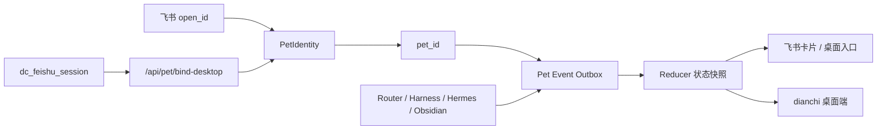

# 「活系统」之宠物系统推进记录

日期：2026-06-15

## 本轮目标

继续推进宠物系统 P0 底座，让飞书聊天小助手、Router、Harness、Hermes、Obsidian/KB、dianchi 桌面端看到同一只宠物，并补齐灰度、资源、绑定链路。

## 已完成

### 1. 后端资源分发

- 已在 DC-Agent 增加 `data/pet_assets/orange-cat-v1/`。
- 已复制桌面端同款 `pet.json` 与 `spritesheet.webp`。
- `/api/pet/assets/orange-cat-v1` 可返回 manifest。
- `/api/pet/assets/orange-cat-v1/spritesheet.webp` 可返回真实资源字节。

### 2. 全局灰度总阀

- 新增 `dc_engines.pet_live.integrations.pet_live_enabled()`。
- `PET_LIVE_ENABLED=false` 时，飞书、Router、桌面 API、Harness、Hermes 均停止发布宠物事件。
- 保留细分开关：
  - `PET_LIVE_API_ENABLED`
  - `PET_LIVE_TAP_ENABLED`
  - `DIANCHI_PET_SCENE_ENABLED`

### 3. 桌面会话绑定

- 新增 `/api/pet/bind-desktop`。
- 绑定要求：
  - 必须存在 `dc_feishu_session` cookie。
  - 必须携带 `PET_LIVE_BINDING_TOKEN` 对应的 `X-Pet-Live-Bind-Token` 或 `Authorization: Bearer ...`。
  - 请求体由可信服务端提供 `feishu_open_id`，桌面端不直接声明身份。
- 成功后写入 `desktop_session_bound` 事件，并让后续 `/api/pet/me`、`/api/pet/events`、`/api/pet/heartbeat`、`/api/pet/actions` 使用同一 `pet_id`。

### 4. 回归测试

已新增或更新测试：

- `tests/test_pet_live_integrations.py`
- `tests/test_pet_live_route.py`
- `tests/test_feishu_pet_assistant.py`
- `tests/dc_router/test_pet_live_tap.py`

已通过验证：

```bash
uv run pytest tests/test_pet_live_integrations.py tests/test_feishu_pet_assistant.py tests/test_pet_live_identity.py tests/test_pet_live_event_bus.py tests/test_pet_live_reducer.py tests/test_pet_live_store.py tests/test_pet_live_route.py tests/dc_router/test_pet_live_tap.py tests/dc_router/test_dispatch_pipeline.py tests/harness/test_pet_live_hermes_bridge.py tests/harness/test_hermes_bridge.py tests/harness/test_pet_live_system_contract.py tests/harness/test_pet_live_obsidian_loop.py tests/harness/test_obsidian_memory_governance_contract.py -q
```

结果：`155 passed, 3 warnings`

```bash
uv run pytest dc_engines/tests/test_pet_live_harness_events.py dc_engines/tests/test_harness_lifecycle.py dc_engines/tests/test_obsidian_memory_codec.py dc_engines/tests/test_obsidian_memory_export_import.py dc_engines/tests/test_obsidian_memory_promotion.py -q
```

结果：`73 passed, 2 warnings`

### 5. 桌面资源缓存

- dianchi-desktop 已新增 `pet_asset_cache_dir()`，服务端下发资源会缓存到用户数据目录。
- `load_pet_asset()` 已升级为“缓存优先、安装包兜底”。
- `ApiClient` 已支持宠物资源二进制下载。
- `PetRuntime` 会在收到服务端宠物状态后自动拉取 `/api/pet/assets/{asset_id}` 和对应 spritesheet。
- `LivePetSceneWidget` 在状态刷新时重新加载 asset package，资源下载完成后会自动切到缓存素材。

已通过校验：

```bash
python3 -m py_compile src/api_client.py src/config.py src/pet_assets.py src/pet_live_client.py src/pet_runtime.py src/pet_scene_view.py
```

缓存优先校验结果：`unit-cat-v1 缓存猫 64 72 b'webp-bytes'`

### 6. 飞书卡片读取 Live State

- `/pet` 状态卡已接入 Pet Live Core 的 `state_after`。
- 飞书状态卡现在优先展示 live 字段：
  - `state`
  - `level`
  - `xp`
  - `energy`
  - `coins`
- 文本兜底也会使用同一份 live state。
- `/done 1` 和卡片完成按钮的完成反馈卡已接入 live state，飞书里看到的能量/XP 与桌面端一致。
- 旧 `PetStore` 字段仍保留为兜底，不影响既有卡片流程。

已通过验证：

```bash
uv run pytest tests/test_feishu_pet_assistant.py -q
```

结果：`11 passed, 3 warnings`

```bash
uv run pytest tests/test_pet_live_integrations.py tests/test_feishu_pet_assistant.py tests/test_pet_live_identity.py tests/test_pet_live_event_bus.py tests/test_pet_live_reducer.py tests/test_pet_live_store.py tests/test_pet_live_route.py tests/dc_router/test_pet_live_tap.py tests/dc_router/test_dispatch_pipeline.py tests/harness/test_pet_live_hermes_bridge.py tests/harness/test_hermes_bridge.py tests/harness/test_pet_live_system_contract.py tests/harness/test_pet_live_obsidian_loop.py tests/harness/test_obsidian_memory_governance_contract.py -q
```

结果：`156 passed, 3 warnings`

### 7. 飞书桌面端正式入口（2026-06-16）

- 飞书宠物卡片已新增“打开桌面端”URL 按钮。
- 插件支持 `desktop_entry_url` 配置项，也支持环境变量 `PET_LIVE_DESKTOP_ENTRY_URL`。
- `desktop_entry_url` 支持 `{user_id}`、`${user_id}`、`{pet_id}`、`${pet_id}` 模板变量。
- `/pet` 状态卡会展示桌面绑定状态：
  - `桌面端：已绑定`
  - `桌面端：待绑定`
- `看看任务`、空任务卡、完成反馈卡也会携带桌面端入口。
- 绑定状态只由 Pet Live identity 的 `desktop_session_id` 推导，飞书卡片不信任前端自报。

已通过验证：

```bash
uv run pytest tests/test_feishu_pet_assistant.py -q
```

结果：`13 passed, 3 warnings`

```bash
uv run pytest tests/test_pet_live_integrations.py tests/test_feishu_pet_assistant.py tests/test_pet_live_identity.py tests/test_pet_live_event_bus.py tests/test_pet_live_reducer.py tests/test_pet_live_store.py tests/test_pet_live_route.py tests/dc_router/test_pet_live_tap.py tests/dc_router/test_dispatch_pipeline.py tests/harness/test_pet_live_hermes_bridge.py tests/harness/test_hermes_bridge.py tests/harness/test_pet_live_system_contract.py tests/harness/test_pet_live_obsidian_loop.py tests/harness/test_obsidian_memory_governance_contract.py -q
```

结果：`160 passed, 3 warnings`

### 8. 公司主页 OAuth 打开桌面端链路（2026-06-16）

- `/Users/dianchi/DC-Agent-WebUI/independent-website/feishu_auth_server.py` 已支持 `/auth/feishu/start?next=desktop`。
- 飞书 OAuth callback 在 `next=desktop` 模式下会：
  1. 生成并设置 `dc_feishu_session`。
  2. 使用 `PET_LIVE_BINDING_TOKEN` 调用 DC-Agent `/api/pet/bind-desktop`。
  3. 返回自动打开 `dianchi://open?session=...` 的 HTML 页面。
- 新增配置：
  - `DC_AGENT_BASE_URL`
  - `PET_LIVE_BINDING_TOKEN`
  - `DIANCHI_DESKTOP_DEEPLINK`
- `DC-Agent-WebUI/README.md` 和 `independent-website/feishu-auth.env.example` 已补充 Pet Live Desktop Entry 部署说明。
- 已新增 WebUI 标准库测试 `tests/test_feishu_auth_server.py`，覆盖 deeplink 编码和绑定请求格式。

已通过验证：

```bash
python3 -m py_compile independent-website/feishu_auth_server.py tests/test_feishu_auth_server.py
```

```bash
python3 -m unittest discover -s tests -q
```

结果：`Ran 3 tests in 0.000s / OK`

### 9. 飞书插件配置接入桌面入口（2026-06-16）

- `data/plugins/feishu_pet_assistant/_conf_schema.json` 已新增 `desktop_entry_url`。
- `data/config/feishu_pet_assistant_config.json` 本地默认已指向：
  - `http://127.0.0.1:8032/auth/feishu/start?next=desktop`
- 飞书卡片现在在本地配置下会直接出现“打开桌面端”按钮，并进入公司主页 OAuth 桌面链路。

已通过验证：

```bash
python3 -m json.tool data/plugins/feishu_pet_assistant/_conf_schema.json
python3 -m json.tool data/config/feishu_pet_assistant_config.json
uv run pytest tests/test_feishu_pet_assistant.py -q
python3 -m unittest discover -s /Users/dianchi/DC-Agent-WebUI/tests -q
```

结果：

- `13 passed, 3 warnings`
- `Ran 3 tests in 0.001s / OK`

### 10. 身份绑定链路冒烟与阻塞项（2026-06-16）

本轮优先验证“飞书 OAuth / 公司主页 8032 → DC-Agent `/api/pet/bind-desktop` → 桌面端同一个 `pet_id`”的生产身份链路，不推进视觉场景重做。

已通过验证：

```bash
uv run pytest tests/test_dashboard.py::test_pet_live_routes_bypass_dashboard_jwt tests/test_pet_live_route.py -q
```

结果：`14 passed, 6 warnings`

- `astrbot/dashboard/server.py` 的 `/api/pet/` Dashboard JWT bypass 已由测试确认。
- 本机 6185 运行实例已重新加载修复，资源接口不再被 Dashboard JWT 拦截：
  - `GET http://127.0.0.1:6185/api/pet/assets/orange-cat-v1`
  - 返回：`HTTP 200`，`status=ok`，包含 `orange-cat-v1` manifest。
- `/api/pet/bind-desktop` 在运行实例上的鉴权顺序已确认：
  1. 无 `dc_feishu_session` cookie：拒绝，返回 `dc_feishu_session cookie is required`。
  2. 有 cookie 但无绑定 token：拒绝，返回 `pet live binding is not authorized`。
  3. 有 cookie 且错误 token：拒绝，返回 `pet live binding is not authorized`。
- “正确 token 可绑定”的路径由 `tests/test_pet_live_route.py` 覆盖；当前本机运行实例未配置 `PET_LIVE_BINDING_TOKEN`，因此不能做真实正确 token 冒烟。
- 公司主页服务 `http://127.0.0.1:8032/` 已可访问，返回官网首页。
- 公司主页桌面入口 `http://127.0.0.1:8032/auth/feishu/start?next=desktop` 当前返回 `HTTP 503`，页面提示缺少 `FEISHU_APP_ID` 和 `FEISHU_APP_SECRET`。

当前阻塞不是代码链路，而是运行环境：

1. DC-Agent 进程需要配置 `PET_LIVE_BINDING_TOKEN`。
2. DC-Agent-WebUI / 公司主页进程需要配置同一个 `PET_LIVE_BINDING_TOKEN`。
3. DC-Agent-WebUI / 公司主页进程需要配置 `FEISHU_APP_ID`、`FEISHU_APP_SECRET`。
4. 正式环境需要把飞书卡片的 `desktop_entry_url` 从 `127.0.0.1:8032` 换成可被员工访问的 HTTPS 域名。

补齐以上变量并重启两个进程后，下一轮真实冒烟路径为：

```text
飞书 /pet 卡片
→ 打开桌面端
→ 8032 /auth/feishu/start?next=desktop
→ 飞书 OAuth callback
→ 8032 使用绑定 token 调 6185 /api/pet/bind-desktop
→ 6185 返回同一个 pet_id
→ 8032 打开 dianchi://open?session=...
→ 桌面端读取 /api/pet/me 并展示同一只宠物
```

### 11. 身份链路诊断脚本落地（2026-06-18）

新增可重复运行的本机诊断脚本：

```bash
scripts-tools/pet_live_identity_smoke.py
```

设计约束：

- 默认不做正确 token 绑定写入，避免误改生产身份数据。
- 默认只做资源接口检查、负向绑定鉴权检查、8032 桌面入口检查。
- 需要真实写入绑定时，必须显式传入 `--mutating-bind`，并确保当前进程环境已有 `PET_LIVE_BINDING_TOKEN`。
- 输出只报告变量是否存在，不打印任何密钥值。

已通过验证：

```bash
python3 -m py_compile scripts-tools/pet_live_identity_smoke.py
scripts-tools/pet_live_identity_smoke.py
```

当前诊断结果：

```text
[BLOCKED] env:FEISHU_APP_ID: missing
[BLOCKED] env:FEISHU_APP_SECRET: missing
[BLOCKED] env:PET_LIVE_BINDING_TOKEN: missing
[OK] dc-agent:pet-assets: http=200 status=ok message=-
[OK] bind:missing-cookie: http=200 status=error message=dc_feishu_session cookie is required
[OK] bind:wrong-token: http=200 status=error message=pet live binding is not authorized
[BLOCKED] bind:correct-token: skipped: pass --mutating-bind after env is configured
[BLOCKED] webui:desktop-entry: http=503 missing FEISHU_APP_ID/FEISHU_APP_SECRET
```

结论：

- DC-Agent 6185 的宠物资源接口和负向绑定安全逻辑稳定。
- DC-Agent-WebUI 8032 已可启动，桌面 OAuth 入口可达。
- 真实飞书 OAuth 和正确 token 绑定仍被运行环境阻塞，需要补齐 `FEISHU_APP_ID`、`FEISHU_APP_SECRET`、`PET_LIVE_BINDING_TOKEN`。
- 下一轮只要环境补齐，直接运行：

```bash
scripts-tools/pet_live_identity_smoke.py --mutating-bind
```

即可验证真实绑定写入路径。

### 12. codex-pets 源码引入与自研版本归档（2026-06-18）

根据当前主线调整，宠物表现层不再继续按自研 `orange-cat-v1` 扩展，而是先把官方参考项目源码复制到本地，后续围绕 codex-pets 做适配。

已完成：

- 自研宠物系统归档：
  - `/Users/dianchi/DC-Agent/archives/自研宠物系统_2026-06-18/`
  - 已包含 Pet Live Core 副本、后端资源包副本、桌面端 `pet_*.py` 副本、桌面端资源包副本。
  - 已新增 `归档说明.md`，标明自研表现层暂停扩展。
- codex-pets 源码引入：
  - 来源：`https://github.com/portons/codex-pet-share`
  - 本地路径：`/Users/dianchi/DC-Agent/vendor/codex-pets/codex-pet-share`
  - 当前提交：`5615902ec508bbd0feb8c6baeab21c951c940824`
  - 已新增 `/Users/dianchi/DC-Agent/vendor/codex-pets/来源说明.md`。

当前边界：

- 已经完成的是“源码引入”和“归档标记”。
- 尚未完成 codex-pets 与 DC-Agent / dianchi-desktop 的运行时适配。
- Pet Live Core 仍然保留为身份、事件、reducer、任务、记忆底座。
- 下一步要做的是 codex-pets 结构分析和适配层设计，而不是继续打磨 `orange-cat-v1`。

下一步建议：

1. 阅读 `vendor/codex-pets/codex-pet-share/src/pets/`、`src/app/`、`src/realtime/`、`src/native/`。
2. 定义 `PetLiveState -> CodexPetsSceneState` 映射。
3. 在桌面端新增 codex-pets 容器/构建产物加载方案。
4. 保持飞书、桌面端、任务系统仍指向同一个 `pet_id`，避免出现第二套宠物身份。

### 13. codex-pets 状态适配骨架接入（2026-06-18）

已开始把 codex-pets 从“源码复制”推进到“运行时适配”。

新增：

- `dc_engines/dc_engines/pet_live/codex_pets_adapter.py`
- `tests/test_codex_pets_adapter.py`

接入：

- `astrbot/dashboard/routes/pet_live.py` 的 `/api/pet/me` 和 `/api/pet/bind-desktop` 返回中新增 `codex_pets` 字段。
- 旧字段 `pet`、`identity`、`last_event_id` 保持不变，兼容现有桌面端和飞书卡片。

当前映射：

| Pet Live 业务状态 | codex-pets 动作状态 |
|---|---|
| `idle` | `idle` |
| `waiting` | `waiting` |
| `thinking` | `review` |
| `working` | `running` |
| `success` | `waving` |
| `failed` | `failed` |
| `review` | `review` |
| `happy` | `waving` |
| `focused` | `idle` |
| `sleeping` | `waiting` |

设计原则：

- Pet Live 继续保留业务状态，不改成 codex-pets 动作状态。
- codex-pets 只作为表现层状态消费方。
- API 同时返回 `live_state` 和 `codex_state`，避免后续调试时混淆。
- vendor 源码不混入 DC-Agent 业务逻辑。

验证：

```bash
uv run pytest tests/test_codex_pets_adapter.py tests/test_pet_live_route.py -q
```

结果：`15 passed, 2 warnings`

下一步：

1. 在 `dianchi-desktop` 增加 codex-pets payload 解析。
2. 设计桌面端 codex-pets 构建产物加载路径。
3. 再决定是嵌入 playground 子集，还是先嵌入只读 pet viewer。

### 14. 桌面端 codex-pets payload 接收（2026-06-18）

已完成桌面端第一步适配，目标是先接收 codex-pets 表现层状态，不立即切换 UI。

改动：

- `/Users/dianchi/dianchi-desktop/src/pet_state.py`
  - 新增 `CodexPetsSceneState`。
  - 新增桌面端同款 `Pet Live -> codex-pets` 状态映射。
- `/Users/dianchi/dianchi-desktop/src/pet_runtime.py`
  - 新增 `self.codex_pets`。
  - `/api/pet/me` 返回 `codex_pets` 时优先使用服务端 payload。
  - 事件流只有旧 `state_after` 时，用本地映射兜底生成 codex-pets 状态。

验证：

```bash
python3 -m py_compile src/pet_state.py src/pet_runtime.py src/pet_live_client.py src/api_client.py
```

结果：通过，无语法错误。

当前边界：

- 桌面端已经能保存 codex-pets 表现状态。
- UI 仍然使用当前自研 `pet_scene_view.py`。
- 下一步是决定 codex-pets 在桌面端以“构建产物嵌入”还是“源码子应用嵌入”的方式接入。

### 15. 桌面端 codex-pets viewer 容器接入（2026-06-18）

已完成桌面端 codex-pets 只读 viewer 骨架。

改动：

- `/Users/dianchi/dianchi-desktop/src/codex_pets_view.py`
  - 新增 `CodexPetsSceneWidget`。
  - 使用 `QWebEngineView` 承载 HTML/Canvas viewer。
  - 消费 `CodexPetsSceneState`，显示 `live_state`、`codex_state`、能量、XP。
  - 检查 spritesheet 是否符合 codex-pets 期望尺寸：`1536x1872`、`9 行 x 8 列`。
- `/Users/dianchi/dianchi-desktop/src/pet_scene_view.py`
  - `build_live_pet_page()` 默认使用 `CodexPetsSceneWidget`。
  - 可通过 `DIANCHI_CODEX_PETS_VIEWER_ENABLED=0` 回退旧原生 viewer。
- `/Users/dianchi/dianchi-desktop/src/web_view.py`
  - 新增 `set_live_pet_codex_state()`。
- `/Users/dianchi/dianchi-desktop/src/main_window.py`
  - `PetRuntime` 状态变化时，同时把 `runtime.codex_pets` 下发给宠物页。
- `/Users/dianchi/dianchi-desktop/src/config.py`
  - 新增 `DIANCHI_CODEX_PETS_VIEWER_ENABLED`。

当前边界：

- 已经接入的是“只读 viewer 容器”，不是完整 codex-pets playground。
- 当前 `orange-cat-v1` 资源仍不是标准 codex-pets 包：
  - 当前 manifest 是自研 `states` 格式。
  - codex-pets 期望 manifest 是 `displayName`、`description`、`kind`、`spritesheetPath`。
  - codex-pets 期望 spritesheet 是 `1536x1872`、`9x8` atlas。
- viewer 会明确提示资源待转换，不会把不兼容资源误标为完成迁移。

验证：

```bash
python3 -m py_compile src/codex_pets_view.py src/pet_scene_view.py src/web_view.py src/main_window.py src/pet_state.py src/pet_runtime.py src/pet_live_client.py src/api_client.py src/config.py
```

结果：通过，无语法错误。

下一步：

1. 生成或导入一个符合 codex-pets 标准的宠物包。
2. 在 DC-Agent 资源 API 中标记 codex-pets 兼容资源。
3. 再把 viewer 从只读 Canvas 骨架升级到 codex-pet-share 的 playground/Three.js 子集。

### 16. orange-cat-v1 转换为 codex-pets 兼容资源包（2026-06-18）

已把当前 `orange-cat-v1` 从自研 10 行 atlas 转换为 codex-pets 兼容 9 行 atlas。

新增：

- `/Users/dianchi/DC-Agent/scripts-tools/build_codex_pet_package.py`

转换来源：

- `/Users/dianchi/DC-Agent/archives/自研宠物系统_2026-06-18/dianchi-desktop/pets/orange-cat-v1/spritesheet.webp`

写入目标：

- `/Users/dianchi/DC-Agent/data/pet_assets/orange-cat-v1/`
- `/Users/dianchi/dianchi-desktop/assets/pets/orange-cat-v1/`

转换结果：

- `spritesheet.webp`：`1536x1872`
- `pet.json`：hybrid manifest
  - codex-pets 字段：`displayName`、`description`、`kind`、`spritesheetPath`
  - 兼容旧 loader 字段：`name`、`scene`、`spritesheet`、`cell`、`states`
  - 标记字段：`codexPets.compatible=true`

行映射：

| codex-pets row | codex-pets 状态 | 自研来源 row | 自研来源状态 |
|---|---|---|---|
| 0 | `idle` | 0 | `idle` |
| 1 | `running-right` | 3 | `working` |
| 2 | `running-left` | 3 | `working` |
| 3 | `waving` | 7 | `happy` |
| 4 | `jumping` | 4 | `success` |
| 5 | `failed` | 5 | `failed` |
| 6 | `waiting` | 1 | `waiting` |
| 7 | `running` | 3 | `working` |
| 8 | `review` | 6 | `review` |

验证：

```bash
python3 -m py_compile scripts-tools/build_codex_pet_package.py
scripts-tools/build_codex_pet_package.py
python3 -m json.tool /Users/dianchi/DC-Agent/data/pet_assets/orange-cat-v1/pet.json
curl --noproxy '*' -i http://127.0.0.1:6185/api/pet/assets/orange-cat-v1
```

结果：

- DC-Agent 和桌面端两份 spritesheet 尺寸均为 `1536x1872`。
- `/api/pet/assets/orange-cat-v1` 返回 `HTTP 200`。
- 返回 manifest 已包含 `displayName`、`spritesheetPath`、`codexPets.compatible=true`。

当前边界：

- 这是资源格式转换，不是美术重做。
- `running-left`、`running-right`、`running` 目前都复用自研 `working` 行。
- `jumping` 暂用自研 `success` 行。
- 下一步可以正式让桌面端 codex-pets viewer 播放该资源，再逐步换成真正官方风格美术。

### 17. 桌面端 codex-pets viewer 真实 GUI 冒烟（2026-06-18）

已确认 codex-pets viewer 进入桌面端组件层，并能渲染转换后的 `orange-cat-v1` spritesheet。

本次补强：

- `/Users/dianchi/dianchi-desktop/src/pet_assets.py`
  - 支持官方 codex-pets manifest 字段：`displayName`、`spritesheetPath`、`atlas.cell`。
  - 继续兼容旧字段：`name`、`spritesheet`、`cell`、`states`。
- `/Users/dianchi/dianchi-desktop/src/pet_runtime.py`
  - 下载资源时优先兼容 `spritesheet` 与 `spritesheetPath`。
- `/Users/dianchi/dianchi-desktop/src/codex_pets_view.py`
  - spritesheet 改为 data URL 注入 `QWebEngineView`，避免 `about:blank` 页面读取本地 `file://` 资源被拦。
  - 等页面加载完成后再推送 `CodexPetsSceneState`，消除早期 JS 调用错误。
- `/Users/dianchi/dianchi-desktop/scripts/verify_codex_pets_viewer.py`
  - 新增桌面端 viewer 冒烟脚本，会实例化 `CodexPetsSceneWidget` 并导出截图。
- `/Users/dianchi/dianchi-desktop/tests/test_pet_assets.py`
  - 新增标准库 `unittest`，验证纯 codex-pets manifest 可以被桌面端资源 loader 读取。

验证：

```bash
/Users/dianchi/dianchi-desktop/.venv/bin/python -m unittest tests.test_pet_assets -v
/Users/dianchi/dianchi-desktop/.venv/bin/python -m py_compile src/pet_assets.py src/pet_runtime.py src/codex_pets_view.py src/pet_scene_view.py src/web_view.py src/main_window.py src/pet_state.py tests/test_pet_assets.py
uv run pytest tests/test_codex_pets_adapter.py tests/test_pet_live_route.py -q
QT_QPA_PLATFORM= /Users/dianchi/dianchi-desktop/.venv/bin/python scripts/verify_codex_pets_viewer.py
```

结果：

- 桌面端资源 loader 测试通过。
- 桌面端相关 Python 文件编译通过。
- DC-Agent codex-pets adapter 与 Pet Live route 测试通过：`15 passed, 2 warnings`。
- 真实 GUI 冒烟通过，截图已生成：
  - `/Users/dianchi/dianchi-desktop/docs/codex_pets_viewer_smoke_2026-06-18.png`

结论：

- 当前版本已经不是原来的纯自研 viewer；桌面端默认入口已切到 codex-pets viewer 容器。
- 当前还不是完整官方 `codex-pet-share` playground，只是桌面端绑定场景需要的只读宠物 viewer。
- 身份层仍以 DC-Agent 服务端 reducer 为准，没有引入第二套前端自嗨状态。
- 真实飞书 OAuth 端到端仍需要本机配置 `FEISHU_APP_ID`、`FEISHU_APP_SECRET`、`PET_LIVE_BINDING_TOKEN` 后再验证。

### 18. 桌面端 session 身份链路本地冒烟（2026-06-18）

本轮继续按“身份闭环优先”推进，目标是验证真实 OAuth 之后的桌面端链路：`dc_feishu_session` cookie 必须能解析到同一个 `pet_id`，并返回同一份 `codex_pets` 表现层状态。

桌面端补强：

- `/Users/dianchi/dianchi-desktop/src/desktop_session.py`
  - 新增无 Qt 依赖的 `dianchi://open?session=...` 解析、session 读取、session 持久化、cookie header 生成。
- `/Users/dianchi/dianchi-desktop/src/app.py`
  - 初始 deep link 参数改用 `session_from_desktop_link()`。
- `/Users/dianchi/dianchi-desktop/src/main_window.py`
  - `handle_desktop_link()` 改用同一套 helper，避免 app 和窗口各维护一套解析逻辑。
- `/Users/dianchi/dianchi-desktop/src/api_client.py`
  - session 加载、保存、cookie header 改由 `desktop_session.py` 统一负责。
- `/Users/dianchi/dianchi-desktop/src/config.py`
  - 新增 `DIANCHI_USER_DATA_DIR` 覆盖项，便于测试时使用临时目录，不污染真实桌面端用户数据。
- `/Users/dianchi/dianchi-desktop/tests/test_desktop_session.py`
  - 新增标准库 `unittest`，验证 deep link session 解析、持久化、重启后复用、cookie header。

服务端补强：

- `/Users/dianchi/DC-Agent/astrbot/dashboard/routes/pet_live.py`
  - 修复 `/api/pet/me` 对“无 cookie”和“有 cookie 但未绑定”的区分。
  - 无 cookie：仍返回 dashboard unbound 视图。
  - 有 cookie 但未绑定：返回 `desktop session is not bound to a pet`，不再伪装成 unbound dashboard。
- `/Users/dianchi/DC-Agent/tests/test_pet_live_route.py`
  - 新增 `test_pet_live_route_rejects_unbound_desktop_session`。
- `/Users/dianchi/DC-Agent/scripts-tools/pet_live_identity_smoke.py`
  - 修正 mutating bind payload 字段为 `feishu_open_id`、`employee_id`。
  - 新增 `--local-store-session`：写入明确标记的本地 smoke 身份，再通过运行中的 `6185 /api/pet/me` 验证同一个 `pet_id`。

验证：

```bash
/Users/dianchi/dianchi-desktop/.venv/bin/python -m unittest tests.test_desktop_session tests.test_pet_assets -v
/Users/dianchi/dianchi-desktop/.venv/bin/python -m py_compile src/config.py src/api_client.py src/app.py src/main_window.py src/desktop_session.py tests/test_desktop_session.py tests/test_pet_assets.py
uv run pytest tests/test_pet_live_route.py tests/test_codex_pets_adapter.py -q
scripts-tools/pet_live_identity_smoke.py --local-store-session
```

结果：

- 桌面端 session/resource 测试通过：`2 tests OK`。
- 桌面端相关文件编译通过。
- DC-Agent Pet Live route 与 codex-pets adapter 测试通过：`16 passed, 2 warnings`。
- 重启 DC-Agent 后，本地身份链路冒烟通过：
  - `desktop-session:/api/pet/me: http=200 status=ok pet_id_match=true codex_state=idle`

仍阻塞：

- `FEISHU_APP_ID` 缺失。
- `FEISHU_APP_SECRET` 缺失。
- `PET_LIVE_BINDING_TOKEN` 缺失。
- 8032 WebUI 当前未运行，所以 `http://127.0.0.1:8032/auth/feishu/start?next=desktop` 仍不可达。

### 19. 真实 OAuth 后桌面端仍显示旧宠物系统的修复（2026-06-18）

真实 OAuth 已完成，8032 能成功生成 `dc_feishu_session` 并调用 DC-Agent `/api/pet/bind-desktop`。随后发现桌面端仍表现为旧宠物系统/未登录状态。

原因：

- 桌面端启动脚本没有设置 `DIANCHI_SERVER_URL`，从浏览器协议唤起时不会自动指向本地 `http://127.0.0.1:6185`。
- `MainWindow._apply_activation_state()` 把 Pet Live 运行时绑定在“工作台已登录且已激活”之后。
- 真实 OAuth session 已经写入 `desktop_session.txt`，但 `/api/me` 在本地 6185 返回 401，导致桌面端停掉 Pet Live，并可能继续展示旧 DyberPet 入口。
- 旧日志中出现 `start running pet ChrisKitty`，说明旧 DyberPet 浮窗曾被自动启动。

修复：

- `/Users/dianchi/dianchi-desktop/启动.app/Contents/MacOS/启动`
  - 新增默认 `DIANCHI_SERVER_URL=http://127.0.0.1:6185`。
- `/Users/dianchi/dianchi-desktop/src/main_window.py`
  - 只要本地存在 `dc_feishu_session`，就启动 Pet Live/codex-pets viewer。
  - Pet Live 不再被 `/api/me` 的登录/激活状态阻断。
  - deep link 成功后直接进入 `宠物系统` 页。
  - 普通启动时，如果已有 `desktop_session.txt`，也直接进入 `宠物系统` 页。
  - `启动宠物` 按钮在 Pet Live session 存在时只打开宠物页，不再启动旧 DyberPet。
- `/Users/dianchi/dianchi-desktop/tests/test_live_pet_activation_gate.py`
  - 增加启动脚本和 Pet Live activation gate 静态回归测试。

验证：

```bash
/Users/dianchi/dianchi-desktop/.venv/bin/python -m unittest tests.test_desktop_session tests.test_pet_assets tests.test_live_pet_activation_gate -v
/Users/dianchi/dianchi-desktop/.venv/bin/python -m py_compile src/main_window.py src/config.py src/api_client.py src/app.py src/desktop_session.py tests/test_live_pet_activation_gate.py
```

结果：

- 桌面端测试通过：`4 tests OK`。
- 编译检查通过。
- 真实 OAuth session 已在 DC-Agent 中绑定：
  - `pet_id=pet_52fcd05b27244e639d952778d1010e0f`
  - `display_name=小橘`
  - `asset_id=orange-cat-v1`
  - `live_state=thinking`
  - `codex_state=review`

## 当前链路



## 剩余优先事项

1. 补齐 `FEISHU_APP_ID`、`FEISHU_APP_SECRET`、`PET_LIVE_BINDING_TOKEN`，启动 8032 后做真实飞书 OAuth 端到端冒烟。
2. 用真实 OAuth 回调验证：8032 生成 session、调用 `/api/pet/bind-desktop`、桌面端 deep link 保存 session、`/api/pet/me` 返回同一个 `pet_id`。
3. 把 codex-pet-share playground/room 的可复用渲染逻辑继续下沉到桌面端，只保留 DC-Agent reducer 作为唯一状态源。
4. 增加桌面端资源下载失败后的安静重试与版本校验。
5. 将当前程序化 `orange-cat-v1` 替换为更接近官方主页的设计 spritesheet 和场景资源。

### 20. 桌宠形态纠偏：live pet 不能退化为页面组件（2026-06-18）

用户复核后确认：第 19 节中的“deep link 后进入宠物系统页 / 启动宠物按钮打开宠物页”方向是错误的。桌宠系统的主形态必须是桌面上的透明悬浮宠物，能在桌面环境中移动、停留和交互；工作台页面里的 codex-pets 视图只能作为 Playground/管理/场景模式，不能替代桌宠本体。

已确认的问题：

- 当前所谓 codex-pets 版本只是“身份链路 + codex-pets atlas 兼容桥”，不是官方 codex-pet-share 的完整产品形态。
- 桌面端曾把 live pet 显示在工作台页面里，这比原始 DyberPet 形态退步。
- 视觉资源仍是自研 `orange-cat-v1` 转换包，不是官方主页所呈现的高质量宠物/场景效果。
- 官方 codex-pet-share 的真实场景核心在 `src/playground/*`，包含 Three.js 场景、RO Prontera biome、动作系统、房间、聊天、换宠物和玩具/NPC 系统；这些还没有完整嵌入桌面端。

本次纠偏：

- `/Users/dianchi/dianchi-desktop/src/codex_pets_desktop.py`
  - 新增 live pet 桌面透明悬浮窗口。
  - 使用同一份 Pet Live / codex-pets 状态和资产缓存。
  - 支持桌面置顶显示、拖动、按状态移动、按 9x8 atlas 行播放动画。
- `/Users/dianchi/dianchi-desktop/src/main_window.py`
  - 有 `dc_feishu_session` 时，启动 Pet Live runtime 后启动桌面悬浮宠物。
  - OAuth deep link 成功后不再自动切到 `宠物系统` 页面。
  - `启动宠物` 按钮在 live session 存在时启动/显示桌面悬浮宠物，不再打开页面版 viewer。
  - 页面内 codex-pets viewer 降级为后续 Playground/场景入口，不作为主桌宠。
- `/Users/dianchi/dianchi-desktop/tests/test_live_pet_activation_gate.py`
  - 增加静态约束：live session 必须调用 `_start_live_pet_desktop()`。
  - 禁止重新引入 `show_local_page("pet")` 作为 live session 默认启动路径。

验证：

```bash
python3 -m unittest discover -s /Users/dianchi/dianchi-desktop/tests -q
python3 -m py_compile /Users/dianchi/dianchi-desktop/src/codex_pets_desktop.py /Users/dianchi/dianchi-desktop/src/main_window.py /Users/dianchi/dianchi-desktop/src/pet_state.py /Users/dianchi/dianchi-desktop/src/codex_pets_view.py
screencapture -x /private/tmp/dianchi_live_pet_overlay_check.png
```

结果：

- 桌面端测试通过：`4 tests OK`。
- Python 编译检查通过。
- 已重启桌面端，PID `46148`。
- 截图确认桌面上出现独立透明悬浮宠物，不再只是页面内组件。
- DC-Agent `http://127.0.0.1:6185/api/pet/assets/orange-cat-v1` 返回 200。

仍需继续：

1. 替换 `orange-cat-v1` 占位资源；它只证明 atlas 链路可用，不代表 codex-pets 成品视觉。
2. 把官方 `codex-pet-share/src/playground/*` 打成桌面可加载的 Playground/场景模式。
3. 桌面悬浮宠物继续保留为主入口，官方 playground 作为“进入场景/房间”的第二形态。
4. 增加真实 UI 自动化断言：启动后必须能在桌面截图中检测到透明悬浮宠物，而不是只检测页面 DOM。

### 21. 替换小橘占位：接入官方 codex-pets 热门宠物包（2026-06-18）

问题：

- `orange-cat-v1 / 小橘` 只是自研资源转出来的链路占位包，不应该继续作为默认产品视觉。
- 官方 `codex-pets.net` 已有更完整、更好看的宠物包，继续折腾小橘会误导方向。

本次处理：

- 从官方站点 `https://codex-pets.net/` 的热门列表 API 拉取宠物：
  - `GET https://codex-pets.net/api/pets?page=1&pageSize=12&sort=popular`
- 下载并落地 3 个官方 `.codex-pet.zip`：
  - `clawd`
  - `doro`
  - `clippit`
- 保存来源标记：
  - `/Users/dianchi/DC-Agent/vendor/codex-pets/official-picks/官方宠物包来源说明.md`
  - `/Users/dianchi/dianchi-desktop/assets/pets/官方宠物包来源说明.md`
- 原始 zip 保存：
  - `/Users/dianchi/DC-Agent/vendor/codex-pets/official-picks/clawd.codex-pet.zip`
  - `/Users/dianchi/DC-Agent/vendor/codex-pets/official-picks/doro.codex-pet.zip`
  - `/Users/dianchi/DC-Agent/vendor/codex-pets/official-picks/clippit.codex-pet.zip`
- DC-Agent 服务端资产目录：
  - `/Users/dianchi/DC-Agent/data/pet_assets/clawd/`
  - `/Users/dianchi/DC-Agent/data/pet_assets/doro/`
  - `/Users/dianchi/DC-Agent/data/pet_assets/clippit/`
- 桌面端内置资产目录：
  - `/Users/dianchi/dianchi-desktop/assets/pets/clawd/`
  - `/Users/dianchi/dianchi-desktop/assets/pets/doro/`
  - `/Users/dianchi/dianchi-desktop/assets/pets/clippit/`

默认切换：

- DC-Agent `PetState` 默认值从 `小橘 / orange-cat-v1` 改成 `Clawd / clawd`。
- 桌面端 `PetState`、fallback asset、codex-pets viewer 默认值改成 `Clawd / clawd`。
- 当前本地 `feishu_pet.db` 中已有 `pet_state_snapshots` 也迁移为：
  - `name=Clawd`
  - `asset_id=clawd`
  - `species=codex-creature`
- `orange-cat-v1` 保留为历史占位资源，不再作为默认视觉。

验证：

```bash
curl -i --max-time 5 http://127.0.0.1:6185/api/pet/assets/clawd
python3 -m unittest discover -s /Users/dianchi/dianchi-desktop/tests -q
uv run pytest tests/test_codex_pets_adapter.py tests/test_pet_live_route.py -q
python3 -m py_compile /Users/dianchi/dianchi-desktop/src/codex_pets_desktop.py /Users/dianchi/dianchi-desktop/src/main_window.py /Users/dianchi/dianchi-desktop/src/pet_state.py /Users/dianchi/dianchi-desktop/src/pet_assets.py /Users/dianchi/dianchi-desktop/src/codex_pets_view.py
screencapture -x /private/tmp/dianchi_clawd_overlay_check_2.png
```

结果：

- `/api/pet/assets/clawd` 返回 200。
- 桌面端测试通过：`4 tests OK`。
- DC-Agent 测试通过：`16 passed, 2 warnings`。
- Python 编译检查通过。
- 已重启桌面端，PID `24149`。
- 截图确认桌面悬浮宠物显示为官方 `Clawd`，不是小橘。

### 22. 保留自研桌宠优势：抓起、拖动、落地（2026-06-18）

用户复核后明确指出：原自研版本至少能作为真正桌宠在桌面上被抓起和拖动，这个体验不能因为接入官方 codex-pets 素材而丢掉。官方宠物包解决“角色视觉”，但桌宠讨喜与否首先取决于桌面行为是否自然、是否有陪伴感。

本次纠偏：

- `/Users/dianchi/dianchi-desktop/src/codex_pets_desktop.py` 移除默认左右机械晃动，不再让桌宠只做无意义往返。
- 左键按住宠物进入 `held` 模式，显示抓取手势，播放 `jumping` 行作为被抓起反馈。
- 拖动时根据鼠标轨迹记录水平/垂直速度。
- 松手后进入 `falling` 模式，按重力下落，碰到地面后弹跳衰减，最终稳定回到 `idle`。
- 桌面悬浮宠物仍使用 DC-Agent Pet Live reducer 的服务端状态作为唯一状态源；拖拽/下落只属于本地表现层，不写第二套业务状态。

验证：

```bash
python3 -m py_compile /Users/dianchi/dianchi-desktop/src/codex_pets_desktop.py
python3 -m unittest discover -s /Users/dianchi/dianchi-desktop/tests -q
open /Users/dianchi/dianchi-desktop/启动.app
screencapture -x /private/tmp/dianchi_grab_fall_check.png
```

结果：

- `codex_pets_desktop.py` 编译通过。
- 桌面端测试通过：`4 tests OK`。
- 已重启桌面端，PID `59529`。
- 截图确认官方 `Clawd` 作为独立桌面悬浮宠物显示在桌面上，不只是页面内组件。
- 下一步需要做真实手感调参：抓起时缩放/表情、松手落地音效、点击气泡、Feishu 消息触发的冒泡/转身/跳跃反馈。

### 23. 桌宠右键菜单 UI 纠偏（2026-06-18）

先纠正：官方 `codex-pet-share` 里没有可直接复制的“桌面宠物右键菜单”。上一版右键菜单只是基于官方 Playground 功能分组做的 MVP 映射，不是官方形态复刻，也不满足原自研宠物系统的完整右键体验。

官方可参考的是 Playground/Web UI 的功能分组：

- `src/playground/ui/PlaygroundHeader.tsx`：`Open as Room`、`Change pet`、room share/close。
- `src/playground/ui/openAsRoomLauncher.tsx`：打开房间的弹出菜单。
- `src/playground/ui/PetSwapMenu.tsx`：房间内换宠物菜单。
- `src/playground/ui/PlaygroundChatBar.tsx`：聊天室输入与表情。
- `src/playground/ui/PlaygroundNpcBar.tsx`：NPC/玩具入口。

原自研/DyberPet 可参考的是完整桌宠右键体系：

- `DyberPet.py::_set_Statusmenu()`：状态头、等级、饱食度、好感度、Dashboard、System。
- `DyberPet.py::_set_menu()`：选择动作、召唤伙伴、更换角色。
- `DyberPet.py::mousePressEvent()`：右键打开状态菜单，左键拖拽时锁定右键菜单。

本次处理：

- `/Users/dianchi/dianchi-desktop/src/codex_pets_desktop.py` 新增桌面原生右键菜单，不依赖工作台页面。
- 右键菜单改为完整桌宠入口骨架：
  - 状态头：宠物名、asset、live state、等级、能量、XP。
  - 直接互动：`摸摸`、`喂食`、`对话`。
  - `选择动作` 子菜单：`打招呼`、`跳一下`、`思考中`、`等待`、`恢复服务端状态`。
  - `召唤伙伴` 子菜单：预留 NPC/伙伴入口。
  - `更换宠物` 子菜单：`打开换宠物面板`、`Clawd`、`Doro`、`Clippit`。
  - 系统入口：`状态面板`、`背包`、`商店`、`进入场景`、`宠物设置`。
  - 窗口控制：`隐藏宠物`、`退出桌面端`。
- `摸摸` 和 `选择动作` 先在桌宠本地播放临时表现状态，不会马上跳二级页。
- `喂食` 接入现有 Pet Live action，source 标记为 `desktop_context_menu`。
- `对话` 打开工作台飞书消息页并刷新会话。
- `状态面板`、`背包`、`商店`、`进入场景`、`宠物设置` 当前进入宠物系统二级页面；后续必须拆成右键菜单内的专用轻面板。
- `隐藏宠物` 直接隐藏当前桌面悬浮宠物，保留工作台入口可召回。
- `退出桌面端` 走主窗口正常关闭流程。

验证：

```bash
python3 -m unittest discover -s /Users/dianchi/dianchi-desktop/tests -q
python3 -m py_compile /Users/dianchi/dianchi-desktop/src/codex_pets_desktop.py /Users/dianchi/dianchi-desktop/src/main_window.py /Users/dianchi/dianchi-desktop/tests/test_desktop_pet_interaction.py /Users/dianchi/dianchi-desktop/tests/test_live_pet_activation_gate.py
open /Users/dianchi/dianchi-desktop/启动.app
```

结果：

- 桌面端测试通过：`8 tests OK`。
- 编译检查通过。
- `tests/test_desktop_pet_interaction.py` 已增加右键菜单静态回归约束，防止后续删除完整右键入口。

### 24. 换掉 Clawd：默认宠物切换为 Doro，并复核飞书交互链路（2026-06-18）

用户明确不喜欢 Clawd 的章鱼/怪物观感，本轮将当前默认宠物切换为 `Doro`。Doro 官方 manifest 描述为白色 chibi 宠物、粉发、紫眼、侧边玫瑰丝带，更适合作为当前桌面陪伴形态。

本次处理：

- DC-Agent `PetState` 默认值改为：
  - `name=Doro`
  - `species=chibi-creature`
  - `asset_id=doro`
- 桌面端 `PetState`、fallback asset、codex-pets viewer 默认值同步改为 `Doro / doro`。
- 本地 `feishu_pet.db` 现有 `pet_state_snapshots` 已迁移：
  - `Clawd / clawd / codex-creature` → `Doro / doro / chibi-creature`
- `scripts-tools/pet_live_identity_smoke.py` 的资源检查从 `orange-cat-v1` 改为 `doro`，避免后续 smoke 继续验证旧占位资源。
- 桌面端飞书工作台补线：
  - `refresh_messages_requested` → `_refresh_conversations`
  - `conversation_selected` → `_refresh_messages`
  - `send_message_requested` → `_send_message`
- 新增 `/Users/dianchi/dianchi-desktop/tests/test_feishu_workspace_wiring.py`，防止飞书消息 UI 信号再次断开。

验证：

```bash
python3 -m unittest discover -s /Users/dianchi/dianchi-desktop/tests -q
uv run pytest tests/test_codex_pets_adapter.py tests/test_pet_live_route.py -q
python3 -m py_compile /Users/dianchi/dianchi-desktop/src/main_window.py /Users/dianchi/dianchi-desktop/src/pet_state.py /Users/dianchi/dianchi-desktop/src/pet_assets.py /Users/dianchi/dianchi-desktop/src/codex_pets_view.py /Users/dianchi/dianchi-desktop/tests/test_feishu_workspace_wiring.py /Users/dianchi/DC-Agent/scripts-tools/pet_live_identity_smoke.py
scripts-tools/pet_live_identity_smoke.py --local-store-session
screencapture -x /private/tmp/dianchi_doro_overlay_check.png
```

结果：

- 桌面端测试通过：`9 tests OK`。
- DC-Agent Pet Live 测试通过：`16 passed, 2 warnings`。
- 编译检查通过。
- `GET /api/pet/assets/doro` 返回 200。
- `pet_live_identity_smoke.py --local-store-session` 结果：
  - `dc-agent:pet-assets` OK。
  - `desktop-session:/api/pet/me` OK，`pet_id_match=true`。
  - `bind:missing-cookie` 与 `bind:wrong-token` 按预期拒绝。
  - 真实 OAuth mutating bind 仍 blocked：当前 shell 环境缺 `FEISHU_APP_ID`、`FEISHU_APP_SECRET`、`PET_LIVE_BINDING_TOKEN`。
- 截图确认桌面端状态栏显示 `Doro · 开心 · 能量 70 · Lv.1`。

飞书交互复核结论：

- 飞书 OAuth / session / Pet Live 身份绑定到宠物状态这条链路已经具备本地 smoke 通过证据。
- 桌面端飞书消息 UI 原本存在信号断线，本轮已修复。
- 后端 `DC-Agent` 目前没有实现桌面端使用的 `/api/workspace/conversations`、`/api/workspace/messages` 路由；现有 `ConversationRoute` 是 dashboard 的 `/conversation/*` 管理接口，不等同于飞书消息小助手接口。
- `/api/workspace/*` 也没有像 `/api/pet/*` 一样基于 `dc_feishu_session` 放行，所以“飞书聊天小助手 ↔ 桌宠语言交互”还没有形成闭环。

下一步：

1. 在 DC-Agent 增加 `/api/workspace/conversations`、`/api/workspace/messages`、`POST /api/workspace/messages`，使用 `dc_feishu_session` 解析员工身份。
2. 将这些 workspace 消息事件写入 Pet Live outbox，让宠物收到飞书消息时有气泡/动作反馈。
3. 桌面端收到消息列表变化时，驱动 Doro 的 `waving/review/jumping` 临时表现状态，不写第二套业务状态。

### 25. 纠偏标记：停止低配自研悬浮窗，转向官方 Playground 搬运（2026-06-18）

用户复核后明确指出：当前 Doro/简化 PySide 悬浮窗形态不但没有达到 codex-pets 官方体验，甚至会因为自动弹出、闪烁、遮挡输入而影响正常工作。本轮将该问题标记为路线错误，而不是继续在单个宠物素材上微调。

错误结论：

- 我之前把 codex-pets 当成“宠物包格式 + spritesheet 播放器”来接入，这是不完整的。
- codex-pets 的主要产品形态不在 `src/pets/PetPreview.tsx`，而在 `src/playground/`：
  - `PetPlaygroundModal.tsx` 组合完整可玩场景。
  - `core/createPlaygroundScene.ts` 创建 Three.js 场景、相机、光照、RO 风格地形、sprite、地面阴影。
  - `hooks/usePlaygroundSceneLoop.ts` 负责场景循环、移动、相机跟随、玩具、NPC、远端角色广播。
  - `core/inputControls.ts` 负责键盘、缩放、相机拖动。
  - `hooks/useRoomBubbles.ts` 与 `room/roomOverlay.tsx` 负责房间气泡。
  - `world/` 负责球、跳板、NPC 等场景物件。
- 因此，后续不能继续手写一个低配 PySide 桌宠窗口来冒充 codex-pets。

本轮修复：

- 立即停掉当前桌面端 GUI 进程，后续开发和测试不再自动打开宠物预览。
- `dianchi-desktop/src/main_window.py` 已改为：
  - 飞书 OAuth deep link 只启动 Pet Live 后台 runtime，不自动弹出桌宠。
  - 启动时发现已有 `dc_feishu_session` 只显示工作台控制，不自动弹出桌宠。
  - 激活状态刷新不再自动 `_start_live_pet_desktop()`，不再自动 `_ensure_pet_started()`。
  - 只有用户点击“启动宠物/召回宠物”按钮时，才显示桌宠。
- `dianchi-desktop/tests/test_live_pet_activation_gate.py` 已增加回归约束，防止后续把自动弹窗加回来。
- Doro 闪烁根因已定位：官方包部分动画行后半段是透明空帧，旧播放器固定播放 8 帧导致周期性消失。`codex_pets_desktop.py` 已改为按行检测有效帧数，并在单图/非 9 行 atlas 时退回第 0 行。
- 本地状态已从 `Doro/doro/chibi-creature` 迁移到 `散猫猫/sanmaomao/legacy-desktop-pet`，仅作为过渡本地资产，不代表最终产品形态。
- 新增资源：
  - `/Users/dianchi/dianchi-desktop/assets/pets/sanmaomao/`
  - `/Users/dianchi/DC-Agent/data/pet_assets/sanmaomao/`

验证：

```bash
python3 -m unittest discover -s tests -q
uv run pytest tests/test_codex_pets_adapter.py tests/test_pet_live_route.py -q
python3 -m py_compile /Users/dianchi/dianchi-desktop/src/main_window.py /Users/dianchi/dianchi-desktop/src/codex_pets_desktop.py /Users/dianchi/dianchi-desktop/src/pet_state.py /Users/dianchi/dianchi-desktop/src/pet_assets.py
sqlite3 /Users/dianchi/DC-Agent/data/feishu_pet.db "select pet_id, json_extract(state_json,'$.name'), json_extract(state_json,'$.asset_id'), json_extract(state_json,'$.species') from pet_state_snapshots;"
```

结果：

- 桌面端测试通过：`11 tests OK`。
- DC-Agent Pet Live 测试通过：`16 passed, 2 warnings`。
- 编译检查通过。
- `pet_state_snapshots` 已全部迁移为 `散猫猫 / sanmaomao / legacy-desktop-pet`。
- 当前没有桌面端 GUI 进程。

下一步主线：

1. 在 `dianchi-desktop` 新增官方 Playground WebView/本地 bundle 容器，承载 `vendor/codex-pets/codex-pet-share/src/playground` 的核心体验。
2. 不再用 PySide 低配悬浮窗承载最终场景；PySide 只负责系统托盘、右键入口、窗口管理、飞书身份传递。
3. 将飞书消息事件转成 playground chat bubble / join toast / pet emotion event，先打通语言交互闭环。
4. 右键菜单保留完整入口，但二级场景进入官方 Playground 容器，不再进入空白管理页。
5. 当前 `sanmaomao` 只作为过渡本地资产和防 Doro 观感问题的临时默认值；后续资产选择服从 Playground 体验。

### 26. 一期实施：员工身份绑定的轻量宠物系统（2026-06-18）

本轮按“员工身份的轻量可视化投影”实施一期，不启动桌宠 GUI，不继续把 Doro/codex-pets 简化播放器当主形态。

已完成：

- Pet Live 身份层改为 `employee_id` 优先：同员工多次 OAuth、替换 `feishu_open_id`、替换 `desktop_session_id` 都回到同一个 `pet_id`。
- `pet_identity_links` 保留 `pet_id` 主键，新增非空 `employee_id` 唯一索引；`feishu_open_id` 改为非空才唯一，支持飞书兜底身份后补员工 ID。
- 增加身份归并逻辑：仅飞书 open_id 兜底创建的宠物，在补齐 `employee_id` 后归并到员工稳定宠物。
- `/api/pet/bind-desktop` 改为 `dc_feishu_session -> employee identity -> stable pet_id -> desktop_session_id`；`/api/pet/me` 返回 `pet_id`、`employee_id`、`feishu_open_id`、`desktop_session_id`、状态和 `light_feedback`。
- PetState 新增轻量字段：`mood`、`focus_level`、`memory_affinity`、`work_rhythm`、`last_signal`。
- 新增蒸馏事件：`assistant_distillation_observed`、`work_habit_updated`、`memory_signal_promoted`；这些事件只更新 outbox/state snapshot 的轻量字段，不改变桌宠启动行为。
- Router、Harness、Hermes、Obsidian、飞书小助手写入 Pet Live outbox 时携带 `employee_id` 或 `source_ref.employee_id`。
- 新增 `/api/workspace/conversations`、`GET/POST /api/workspace/messages`，基于 `dc_feishu_session` 解析到同一个宠物身份；默认不发真实飞书消息，只写 Pet Live 轻反馈事件；显式配置 sender 或打开 `WORKSPACE_FEISHU_SEND_ENABLED=1` 后走 Feishu Open Platform 文本发送。
- 桌面端保留不自动弹出防线；状态刷新只更新状态条/本地状态对象，不调用 `_start_live_pet_desktop()`。

验证新增：

```bash
uv run pytest tests/test_pet_live_identity.py tests/test_pet_live_event_bus.py tests/test_pet_live_reducer.py tests/test_pet_live_route.py tests/test_workspace_route.py tests/dc_router/test_pet_live_tap.py tests/harness/test_pet_live_system_contract.py tests/harness/test_pet_live_hermes_bridge.py dc_engines/tests/test_pet_live_harness_events.py -q
uv run pytest dc_engines/tests/test_feishu_hub.py -q
uv run pytest tests/test_pet_live_identity_smoke_script.py -q
python3 -m unittest tests.test_live_pet_activation_gate tests.test_desktop_pet_interaction tests.test_feishu_workspace_wiring
```

真实环境 e2e 已补验：在本机凭证和 `WORKSPACE_FEISHU_SEND_ENABLED=1` 下，后台 POST `/api/workspace/messages` 返回 `sent=true`，获得 Feishu provider message id，并在同一 `pet_id` outbox 写入 `feishu_message_received`、`assistant_response_sent`。验证只走后台 Quart test client 和 Feishu Open Platform，不启动桌宠 GUI。

绑定授权路径已补验：在本机 `PET_LIVE_BINDING_TOKEN` 下，后台 POST `/api/pet/bind-desktop` 可把 smoke `employee_id`、Feishu open_id 和 `dc_feishu_session` 绑定到同一个 `pet_id`；同员工更换 open_id 后仍保持同一 `pet_id`，`/api/pet/me` 可用该 session 读回同一身份。

真实后台 smoke 已固化到 `scripts-tools/pet_live_identity_smoke.py`：新增 `--employee-id`、`--rotated-open-id`、`--workspace-send-message`、`--expect-feishu-send`、`--skip-webui`。脚本默认不打开浏览器、不触发 deep link、不启动桌宠；显式加 `--mutating-bind` 才写绑定，显式加 `--workspace-send-message` 才写 workspace 消息事件/可能发送飞书消息。本轮已用该脚本在 6185 上跑通：资产、负向绑定、正确 token 绑定、员工稳定 `pet_id`、workspace 真实发送全部 OK。

小助手消息回流补线：`/api/workspace/conversations` 现在会返回默认“飞书小助手”会话，并用同一 `pet_id` 的 Pet Live outbox 生成会话预览；`GET /api/workspace/messages` 会回放 workspace 消息事件，桌面端发送的文本和“已发送到飞书小助手”的发送确认可以直接出现在原生消息列表。真实后台 e2e 已验证：POST `/api/workspace/messages` 后，GET `/api/workspace/messages` 能读回刚发出的用户文本，并能看到 `assistant_response_sent` 对应的助手侧确认。

飞书真实历史读取已验证并接入：新增 `scripts-tools/feishu_message_read_probe.py`，默认脱敏输出消息正文，只报告数量、类型、message_id/chat_id 摘要；显式 `--send-probe-text` 时会先发送一条探测消息并用返回的 `chat_id` 调 `im.v1.message.list`。本轮真实 probe 证明当前应用具备消息历史读取权限，`WORKSPACE_FEISHU_READ_ENABLED=1` 已打开；`/api/workspace/messages` 现在会在 outbox 兜底基础上合并 Feishu 历史，读失败时仍返回 outbox，不让桌面空白。真实后台 e2e 已验证：`history_status=ok`、`has_feishu_history=true`、`history_contains_sent_text=true`。

小助手真实回复轻反馈已接入但做了防回灌：Feishu 历史中的助手侧消息只在晚于当前会话已有 workspace outbox 事件时，才写入 `assistant_message_observed` 并更新 `last_signal`；没有本地会话上下文或属于旧历史的消息只展示在消息列表，不触发新的宠物轻反馈，避免历史回放刷屏。

真实发送验证已加显式防线：`scripts-tools/pet_live_identity_smoke.py` 在 `WORKSPACE_FEISHU_SEND_ENABLED=1` 时，必须额外传 `--allow-real-feishu-send` 才会执行 workspace 发送检查；`scripts-tools/feishu_message_read_probe.py --send-probe-text` 也必须同时传 `--allow-real-feishu-send`。默认验证路径保持只读或单元测试，避免再次向真实飞书会话写入 smoke 文本。

桌面端未正常运行的本轮诊断与修复：

- 本机 `6185` 由 DC-Agent 进程监听，当前并没有实际桌面 GUI 进程；桌面问题不是宠物窗口被隐藏，而是桌面端没有完成身份绑定。
- `启动.command` 原来没有设置 `DIANCHI_SERVER_URL`，会落到桌面端默认线上地址；已改为默认 `http://127.0.0.1:6185`，并禁用代理。
- `scripts/rebuild_macos_launcher.sh` 已同步补上 `DIANCHI_SERVER_URL`，避免后续重建 `.app` 时把本地入口修正冲掉。
- `/api/pet/bind-desktop` 已支持用有效 `dc_feishu_session` 的签名内容自动解析 `employee_id` 与 `feishu_open_id`，桌面端不再需要也不应该直接声明员工身份。
- 桌面端 `ApiClient` 新增 `bind_pet_desktop()`；`MainWindow` 在已有 session 或 deep link 后只做后台绑定与 Pet Live runtime 启动，不调用 `_start_live_pet_desktop()`，不弹出悬浮宠物。
- 当前本机 `desktop_session.txt` 已过期，本轮脱敏探针返回 `pet live session is expired or invalid`。因此要让用户当前桌面端恢复，需要重新走一次飞书 OAuth/打开桌面端，生成新的 `dc_feishu_session`；有效新 session 会自动后台绑定到同一员工 `pet_id`。
- 桌面端新增过期 session 安静清理路径：后台绑定返回 `pet live session is expired or invalid` 时，客户端会停止 Pet Live runtime、隐藏宠物控制条、清掉本地 `desktop_session.txt`，并提示重新从公司主页打开桌面端；不会启动悬浮宠物。
- 桌面端激活横幅的“打开入口”已改为专用桌面 OAuth URL，不再误跳到飞书 Messenger；启动器默认设置 `DIANCHI_DESKTOP_AUTH_URL=http://127.0.0.1:8032/auth/feishu/start?next=desktop`。
- 本机 `8032` homepage/OAuth 服务已后台启动，使用同一套飞书 App 凭证和 `PET_LIVE_BINDING_TOKEN`；`/auth/feishu/start?next=desktop` 已脱敏验证返回 302 到 `accounts.feishu.cn/open-apis/authen/v1/authorize`，并设置 OAuth state cookie。
- DC-Agent-WebUI 新增 `scripts/start_homepage_oauth.py`，用于可重复启动/检查本地 homepage OAuth 服务；它按字面量读取 `/Users/dianchi/.dc-agent.env`，不通过 shell 展开 secret，不打印凭证，优先复用已监听的 `8032`。
- 后端已用 `safe_restart.sh astrbot` 重启并通过 card-system 自检。

新增验证：

```bash
uv run pytest tests/test_pet_live_route.py tests/test_workspace_route.py tests/test_pet_live_reducer.py -q
python3 -m unittest tests.test_live_pet_activation_gate tests.test_desktop_session tests.test_feishu_workspace_wiring
python3 -m py_compile /Users/dianchi/DC-Agent/astrbot/dashboard/routes/pet_live.py
python3 -m py_compile /Users/dianchi/dianchi-desktop/src/api_client.py /Users/dianchi/dianchi-desktop/src/main_window.py /Users/dianchi/dianchi-desktop/src/pet_runtime.py
SAFE_RESTART_WATCHDOG_QUIET_SECONDS=0 /Users/dianchi/DC-Agent/scripts-tools/safe_restart.sh astrbot
python3 -m unittest tests.test_feishu_auth_server  # /Users/dianchi/DC-Agent-WebUI
HEAD http://127.0.0.1:8032/auth/feishu/start?next=desktop  # 仅脱敏检查状态码/Location host
/Users/dianchi/DC-Agent/.venv/bin/python scripts/start_homepage_oauth.py  # /Users/dianchi/DC-Agent-WebUI
```

结果：

- DC-Agent 路由/Workspace/Reducer 测试通过：`31 passed, 2 warnings`。
- 桌面端无 GUI 单测通过：`5 tests OK`。
- Python 编译检查通过。
- 后端重启自检通过：`Card System: OK`。
- 当前真实桌面 session 探针按预期返回过期/无效；没有启动桌面 GUI。
- 继续补测过期清理路径后，桌面端无 GUI 单测为 `6 tests OK`，编译检查通过。
- DC-Agent-WebUI OAuth 单测通过：`3 tests OK`。
- `scripts/start_homepage_oauth.py` 验证通过：识别现有 `8032`，并脱敏报告 OAuth 入口 `302 -> accounts.feishu.cn/open-apis/authen/v1/authorize`。
- `8032` 当前由后台 homepage 服务监听；没有启动桌面 GUI。

2026-06-23 真人桌面启动补测：

- 用户明确要求开始真人测试后，本轮只启动桌面主窗口，不启动宠物悬浮层。
- 新增桌面早期启动诊断日志：`~/Library/Logs/DianchiDesktop/startup-debug.log`。日志只记录阶段名、PID、Python 版本和 Qt 主循环状态，不写 session、secret 或 cookie。
- 诊断确认 `/Users/dianchi/dianchi-desktop/启动.app/Contents/MacOS/启动` 能进入 `.venv/bin/python main.py`，并走到 `main:exec:start`；修复后桌面主进程 PID `4157` 正常停留在 Qt 主循环。
- 修复桌面端过期 session 清理分支：`WorkspaceView` 原来定义了 `_build_messages_page()`，但没有把消息页挂进 `QStackedWidget`，导致后台绑定返回 `pet live session is expired or invalid` 时调用 `set_messages()` 抛 `AttributeError: message_layout`。现在新增“消息”页并默认初始化，官方飞书 WebView/OAuth 保留在单独“飞书”页。
- 小助手消息桌面入口补齐：`/api/workspace/conversations`、`/api/workspace/messages` 对应原生“消息”页；宠物右键“对话/聊天”入口也切到消息页，不再误跳官方 Feishu WebView。
- 重新验证后，旧 PID `90478` 的 `message_layout` 异常没有在新 PID `4157` 重现；当前仍未自动启动 codex-pets/宠物悬浮层。
- 同步更新 `scripts/rebuild_macos_launcher.sh`，避免重建 `.app` 时丢失本地 `6185`、`8032` 默认入口和启动诊断日志。

新增验证：

```bash
/Users/dianchi/dianchi-desktop/.venv/bin/python -m py_compile main.py src/app.py src/main_window.py src/web_view.py src/feishu_view.py src/shared_profile.py
python3 -m unittest tests.test_live_pet_activation_gate tests.test_desktop_session tests.test_feishu_workspace_wiring
sh -x /Users/dianchi/dianchi-desktop/启动.app/Contents/MacOS/启动
pgrep -fl 'dianchi-desktop|巅池桌面端|启动.app|python.*main.py|Python.*main.py|codex_pets'
tail -80 ~/Library/Logs/DianchiDesktop/startup-debug.log
```

结果：桌面端编译检查通过；无 GUI 单测 `7 tests OK`；真人启动进入 Qt 主循环；进程列表只出现桌面主进程和 DC-Agent 后端，没有 codex-pets/宠物悬浮层。

当前链路：

`employee_id` + 飞书 open_id 兜底 + `dc_feishu_session` -> `/api/pet/bind-desktop` -> `PetIdentity` -> `pet_id` -> Pet Event Outbox -> Reducer 状态快照 -> 飞书卡片 / workspace API / 桌面入口与 dianchi 桌面端。Router、Harness、Hermes、Obsidian、workspace 消息事件也进入同一个 outbox。
