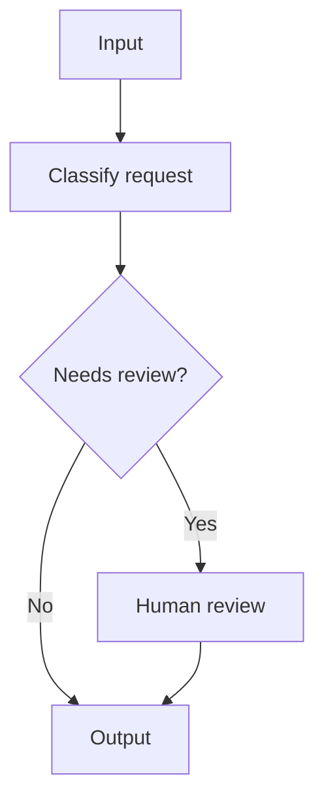
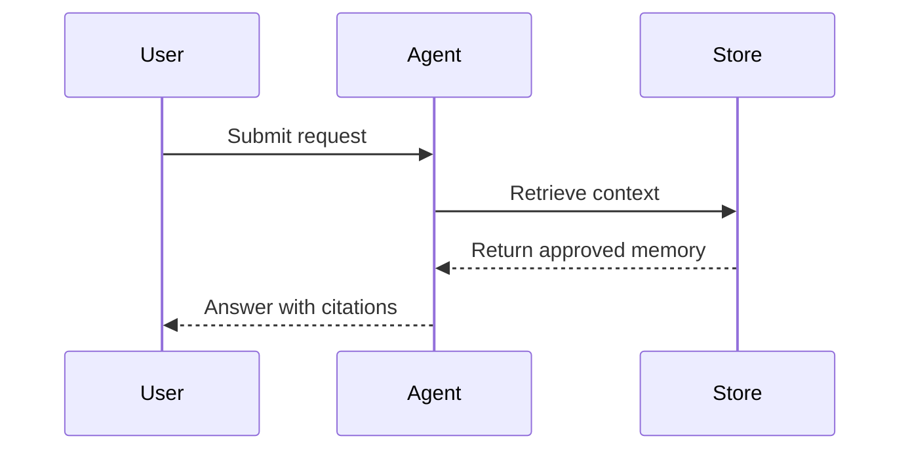
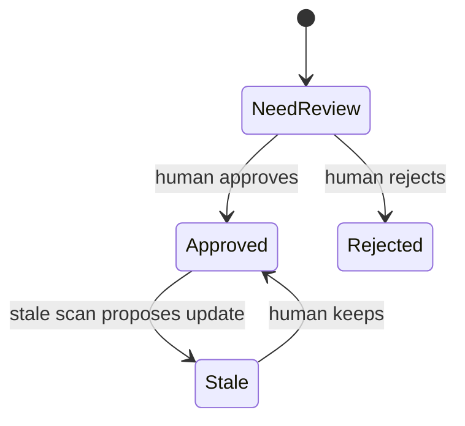

# Mermaid Visualizer

Create clear Mermaid diagrams from prose, notes, SOPs, contracts, and system descriptions. Optimize for Obsidian and GitHub renderers first, because they may run stricter Mermaid versions than the live editor.

This skill is adapted for DC-Agent from Axton Liu's `axton-obsidian-visual-skills` Mermaid visualizer. It is an authoring skill only: generate Markdown/Mermaid text, do not execute local tools or access vault files.

## Workflow

1. Identify the structure in the user's content: sequence, hierarchy, state transitions, comparison, circular process, or component interaction.
2. Choose the smallest diagram type that makes the relationship clear.
3. Generate Mermaid code inside a fenced `mermaid` block.
4. Keep labels short and readable. Use node IDs for references and display text only inside node declarations.
5. Validate common syntax pitfalls before returning the diagram. See [Syntax Rules](references/SYNTAX_RULES.md).

## Diagram Selection

| Content shape | Mermaid type | Use for |
| --- | --- | --- |
| Ordered steps, branching, feedback | `graph TB` or `graph LR` | workflows, SOPs, routing, agent pipelines |
| Component calls over time | `sequenceDiagram` | APIs, message flows, platform integrations |
| Lifecycle or status transitions | `stateDiagram-v2` | review states, task states, memory governance |
| Hierarchical concepts | `mindmap` | knowledge maps, topic breakdowns, planning trees |
| A/B or before/after | `graph TB` with parallel subgraphs | comparisons, tradeoffs, migrations |
| Repeated improvement loop | `graph TB` with feedback edge | review loops, governance loops, iteration cycles |

Default to `graph TB` for ambiguous process descriptions. Use `graph LR` when the user asks for horizontal layout, timeline-like reading, or slide-friendly wide diagrams.

## Output Rules

- Always wrap the result in a Markdown code fence with `mermaid`.
- Prefer ASCII node IDs such as `intake`, `router`, `review_queue`.
- Use quoted display labels for text with spaces: `node_id["Readable label"]`.
- Reference nodes and subgraphs by ID only, never by display label.
- Use subgraph IDs with display labels: `subgraph governance["Governance Loop"]`.
- Avoid emojis in node labels. Use text and color instead.
- Do not use `1. Step` inside node text; use `Step 1: Step`, `1.Step`, or `(1) Step`.
- Keep node labels under about 50 characters. Split dense content into multiple nodes.
- Add style declarations for important categories when it improves readability.

## Common Patterns

### Process Flow

### Sequence Diagram

### State Diagram

## Professional Palette

- Start/input: `fill:#d3f9d8,stroke:#2f9e44`
- Decision/risk: `fill:#ffe3e3,stroke:#c92a2a`
- Processing/reasoning: `fill:#e5dbff,stroke:#5f3dc4`
- Action/tool use: `fill:#ffe8cc,stroke:#d9480f`
- Output/result: `fill:#c5f6fa,stroke:#0c8599`
- Storage/memory: `fill:#fff4e6,stroke:#e67700`
- Neutral/background: `fill:#f8f9fa,stroke:#868e96`

## Quality Checklist

- No `number. space` pattern in node labels.
- Every edge references a defined node ID.
- Subgraphs with spaces use `subgraph id["Display name"]`.
- Graph direction is explicit: `TB`, `LR`, `BT`, or `RL`.
- Special characters in labels are quoted or simplified.
- The result is useful in Obsidian without requiring plugins beyond Mermaid rendering.
