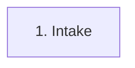
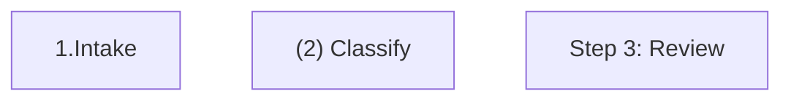
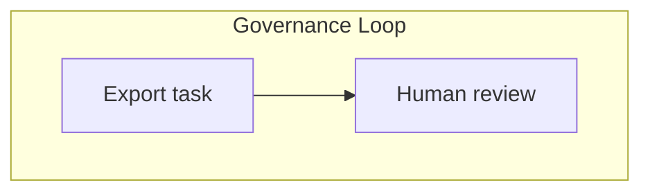
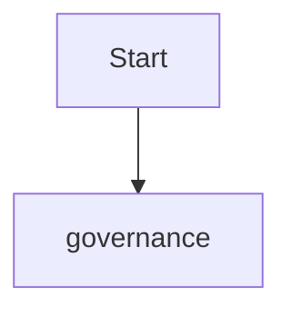
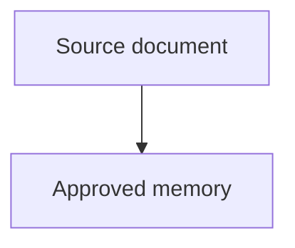
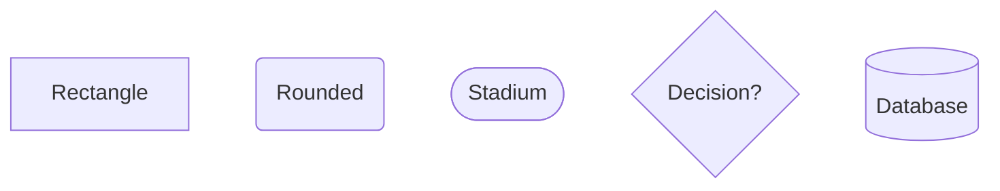
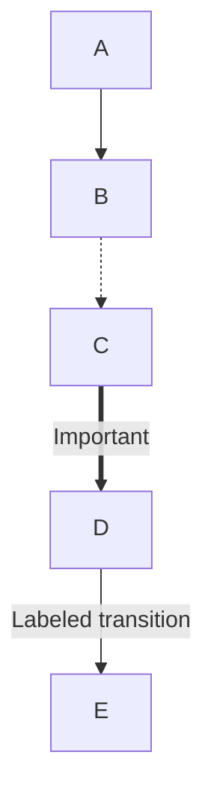
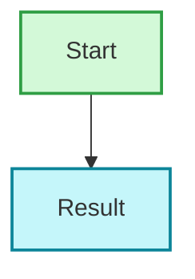

# Mermaid Syntax Rules

Use these rules when generating or troubleshooting Mermaid diagrams for Obsidian and GitHub.

## Critical Error Prevention

### Ordered List Conflicts

Mermaid can parse `number. space` inside node labels as Markdown ordered-list syntax.

Avoid:

Use one of these instead:

### Subgraph Names

Subgraphs with spaces need an ID plus display label.

Reference the ID, not the display name:

### Node References

Define readable labels inside node declarations, then reference IDs.

Do not write edges between display text labels.

## Node Syntax

Keep label text short. Use separate annotation nodes when details do not fit.

## Arrows

Use dashed arrows for optional, supporting, or feedback paths. Use thick arrows sparingly for the main emphasized path.

## Styling

Prefer hex colors and consistent category meanings across the diagram.

## Validation Checklist

- Direction is declared after `graph`: `TB`, `LR`, `BT`, or `RL`.
- No edge points to a display label.
- Every node ID is unique.
- Every edge endpoint is defined.
- Every subgraph with spaces uses `subgraph id["Display name"]`.
- Labels avoid unescaped quotes, raw parentheses in fragile contexts, and long paragraphs.
- The diagram is readable without relying on Mermaid Live Editor-only features.
