# 企业定制礼品项目全流程思维导图

> 适用场景：企业客户礼品定制、会议礼品、节庆礼盒、客户答谢礼、员工福利及活动伴手礼。
>
> XMind 可编辑版：[企业定制礼品项目全流程管理.xmind](./企业定制礼品项目全流程管理.xmind)

```mermaid
---
config:
  layout: tidy-tree
---
mindmap
  root((企业定制礼品项目<br/>全流程管理))
    一、项目接收与需求立项
      市场部牵头对接甲方
        明确项目背景与使用场景
          节庆赠礼
          商务拜访
          会议活动
          员工福利
          客户答谢
        确认目标人群
          客户级别与人数
          年龄、性别与地域
          收礼偏好与禁忌
          寄送地址与覆盖范围
        收集核心需求
          礼品品类与数量
          单份预算与总预算
          交付时间与活动日期
          LOGO、品牌色与宣传语
          包装、贺卡、手提袋需求
          个性化刻字或编号需求
          配送方式与到货地点
        确认商务条件
          报价口径与含税要求
          付款节点与账期
          合同主体与开票信息
          知识产权及保密要求
      策划部协同立项
        进行行业与竞品调研
        分析历史项目与可复用资源
        判断预算、工期和数量可行性
        建立项目排期与任务分工
        建立需求变更记录
      立项输出物
        客户需求确认表
        项目任务书
        初步预算表
        项目排期表
        跨部门责任分工表
      立项审核点
        需求是否完整明确
        预算是否覆盖全部成本
        交付周期是否留有缓冲
        定制内容是否合规可生产
        甲方是否书面确认需求

    二、礼品策划与方案提报
      策划部牵头构思
        确定礼品主题
          品牌传播主题
          节庆文化主题
          活动主题
          情感关怀主题
        设定选品原则
          符合品牌调性
          兼顾实用性与记忆点
          适配目标人群
          便于运输与长期保存
          满足预算和交期
        规划礼品组合
          单品方案
          礼盒套装方案
          不同客群分级方案
          标准款与升级款方案
        形成备选方案
          方案A：稳妥实用型
          方案B：创意传播型
          方案C：品质升级型
      市场部协同审核
        核对甲方原始需求
        验证品牌调性与客户偏好
        反馈预算和商务限制
        组织甲方提案与意见收集
      方案成本测算
        产品采购成本
        设计与打样成本
        定制工艺成本
        包材与包装成本
        仓储与物流成本
        税费、损耗与应急预备金
      方案输出物
        礼品策划方案PPT
        选品清单与规格说明
        效果参考图
        初版报价单
        项目时间节点表
      方案确认点
        甲方确认选品方向
        甲方确认数量与预算
        甲方确认定制范围
        甲方确认交付时间
        所有修改形成书面记录

    三、产品与包装设计
      设计部接收设计任务
        获取完整品牌资料
          LOGO源文件
          VI规范与品牌色值
          标准字体与禁用规范
          宣传文案和法务审核稿
        获取产品制作资料
          产品尺寸与刀模文件
          材质和工艺限制
          印刷区域与安全边距
          包装结构与承重要求
      设计内容
        礼品本体外观
        LOGO与图案排版
        礼盒外包装
        内托与产品摆放
        贺卡、说明书与封套
        手提袋、贴纸与封签
        快递外箱与运输标识
      设计评审
        策划部审核创意与主题一致性
        市场部审核客户需求与品牌规范
        执行部门审核生产工艺可行性
        甲方审核文字、尺寸、颜色和版式
      设计输出物
        平面效果图
        三维效果图或场景图
        可生产源文件
        印刷文件与刀模文件
        材质工艺标注表
        最终设计确认单
      设计管控点
        校对文字、日期与联系方式
        核对LOGO比例及清晰度
        使用标准色值并注明色差范围
        确认字体、图片和素材版权
        定稿后锁版并做好版本管理

    四、供应商询价与资质审核
      活动执行部门牵头询价
        编制统一询价文件
          产品名称与技术参数
          材质、尺寸、颜色和工艺
          数量及阶梯报价要求
          打样和量产交期
          包装、运输与税费要求
          售后与质量赔付要求
        原则上进行多家比价
        统一报价口径避免漏项
        记录报价有效期和产能情况
      收集供应商资质
        营业执照与经营范围
        开户及开票资料
        产品检测或质量认证
        品牌授权或经销授权
        食品、化妆品等专项许可
        过往案例与客户评价
        生产场地与产能证明
      供应商评估
        报价合理性
        产品与工艺能力
        交付稳定性
        质量控制能力
        响应速度与配合度
        售后与异常处理能力
        合规及财务风险
      定标与商务确认
        形成比价表和推荐意见
        明确含税单价与总价
        明确打样费、版费和模具费
        明确付款方式和违约责任
        明确知识产权和保密条款
        完成内部审批及供应商定标
      阶段输出物
        询价单
        供应商资质档案
        供应商评估表
        比价与定标审批表
        合同或采购订单

    五、打样确认与封样
      打样前准备
        向供应商发送锁版文件
        明确样品数量和完成时间
        明确材质、工艺和包装标准
        设置验收标准和允许偏差
      样品制作
        白样或结构样
        数码样或颜色样
        工艺样或功能样
        完整成品样
      内部验样
        设计部核对颜色、图案和版式
        策划部核对创意效果和完整性
        市场部核对客户需求
        执行部门核对材质、工艺和功能
        必要时进行跌落、承重或使用测试
      甲方确认
        提供实物样品及效果说明
        记录甲方修改意见
        修改后重新打样或局部签样
        取得书面签样确认
      封样管理
        最终样品编号并拍照留档
        甲乙双方保留标准样
        样品作为量产验收依据
        未经审批不得更换材质和工艺
      阶段输出物
        打样申请单
        样品验收记录
        修改清单
        客户签样确认单
        封样照片与实物样

    六、批量生产与质量管控
      下达量产
        按签样文件下达采购订单
        核对SKU、数量和交期
        明确备品备损比例
        确认包装方式与箱唛信息
        制定生产及验货计划
      生产跟进
        原材料到位确认
        首件生产确认
        关键工序进度跟踪
        每日或阶段性进度反馈
        延误风险提前预警
      质量检验
        来料检验
        首件检验
        生产过程抽检
        成品抽检或全检
        包装及装箱检验
      重点验收项目
        产品数量和规格
        材质、颜色与气味
        LOGO位置与印刷清晰度
        功能、配件和组装完整性
        表面破损、污渍与色差
        礼盒、内托和封装牢固度
        条码、标签、箱唛和批次信息
      异常处理
        隔离不合格品
        形成问题照片和质检报告
        返工、补货或更换
        评估交期与成本影响
        重大异常及时同步甲方
      阶段输出物
        生产进度表
        首件确认记录
        质检报告
        异常整改记录
        成品验收单

    七、到货验收与出入库管理
      到货前准备
        确认到货时间和卸货条件
        提前安排库位与收货人员
        准备订单、签样和验收标准
      到货验收
        核对供应商送货单
        核对SKU、箱数和总数量
        检查外箱及产品完好度
        按封样和质检标准抽检
        差异、破损和少货现场记录
      入库管理
        建立入库单
        按品类、批次和用途分区
        粘贴库位及物料标识
        登记合格品、次品和备品
        实物数量与系统台账一致
      库存管理
        设置专人保管和领用权限
        每次领用同步更新台账
        活动前进行库存盘点
        防潮、防压、防火和防丢失
      出库管理
        根据审批后的发放计划备货
        复核领取人、数量和用途
        建立出库单和签领记录
        退回礼品重新验收并入库
      阶段输出物
        到货验收单
        入库单与库存台账
        出库单与领用记录
        破损差异处理单
        库存盘点表

    八、礼品发放与活动执行
      发放方案
        明确发放对象与资格
        建立姓名、联系方式和地址清单
        设置不同客群对应礼品等级
        确定现场领取或快递寄送
        明确防重复、防错发规则
      现场发放
        分区陈列和批次备货
        扫码、签到或凭证核销
        双人复核礼品种类和数量
        领取人签字或电子确认
        每日盘点剩余库存
      快递寄送
        校验收件信息和隐私权限
        生成面单并核对礼品等级
        记录快递单号和寄出时间
        跟踪签收、拒收和退回
        处理破损、丢件和补寄
      发放数据管理
        计划发放数量
        实际发放数量
        未发、退回和损耗数量
        领取人或收件人明细
        快递单号和签收状态
        剩余库存及去向
      现场支持
        执行部门负责陈列、发放与盘点
        策划部核对活动呈现效果
        市场部维护重点客户并收集反馈
        异常情况现场登记并及时升级
      阶段输出物
        发放计划表
        礼品发放明细表
        签领或签收凭证
        现场问题记录
        剩余礼品清单

    九、项目结算与复盘归档
      财务结算
        核对合同、订单和验收单
        核对实际数量及增减项
        核验发票和付款资料
        计算项目实际总成本
        完成供应商付款与项目结算
      项目复盘
        对比预算成本与实际成本
        对比计划进度与实际进度
        统计合格率、损耗率和补发率
        汇总客户满意度与投诉
        评价供应商质量和履约表现
        沉淀问题原因与改进措施
      剩余物资处理
        退还客户
        转入常备库存
        用于后续活动
        报损或合规处置
        所有去向留痕
      资料归档
        需求及确认记录
        策划方案与设计源文件
        报价、合同与采购订单
        供应商资质与评估资料
        样品、质检和验收记录
        出入库及发放明细
        发票、结算和付款凭证
        项目复盘报告
      项目成果
        建立礼品案例库
        建立合格供应商库
        建立历史价格数据库
        建立常用材质工艺库
        形成可复用项目SOP

    十、跨部门协作与风险控制
      部门职责
        市场部
          对接甲方并管理需求
          推动客户确认与商务沟通
          维护客户关系并收集反馈
        策划部
          负责主题、选品和方案构思
          统筹方案内容与项目节奏
          支持提案和活动呈现
        设计部
          负责产品及包装视觉设计
          输出可生产文件
          参与样品和量产品控
        活动执行部门
          负责询价、资质、合同与采购
          跟进打样、量产、验收和物流
          管理出入库、发放和执行数据
        财务与法务支持
          审核预算、付款与发票
          审核合同、授权和合规风险
      协作机制
        明确唯一项目负责人
        建立项目群和统一文件夹
        重要节点使用书面确认
        每周或关键节点同步进度
        需求变更必须评估成本与交期
        文件统一命名并控制版本
      核心风险
        预算风险
          漏项、临时增项、报价失效
        交期风险
          设计反复、打样延迟、物流延误
        品质风险
          色差、破损、工艺不一致、功能异常
        合规风险
          商标侵权、素材版权、资质缺失
        数据风险
          收件信息泄露、名单错发或重复发放
        库存风险
          台账不符、礼品遗失、剩余积压
        现场风险
          礼品不足、秩序混乱、异常未留痕
      关键里程碑
        M1 需求书面确认并完成立项
        M2 礼品方案及预算确认
        M3 设计锁版并通过客户审核
        M4 供应商定标及合同生效
        M5 样品签字确认并完成封样
        M6 量产完成并通过质量验收
        M7 到货入库并完成数量复核
        M8 礼品发放完成且数据闭环
        M9 结算、复盘与资料归档完成
```

## XMind / 幕布可复制层级

将上方导图各层级按缩进复制到 XMind、幕布、ProcessOn 或其他支持 Markdown 大纲导入的工具中即可。中心主题为“企业定制礼品项目全流程管理”，十个一级主题依次对应项目从立项到复盘的完整闭环。
