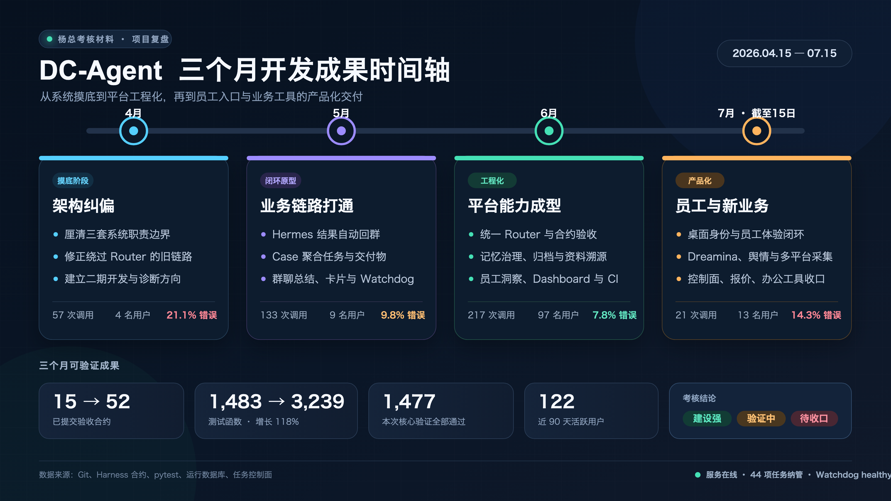
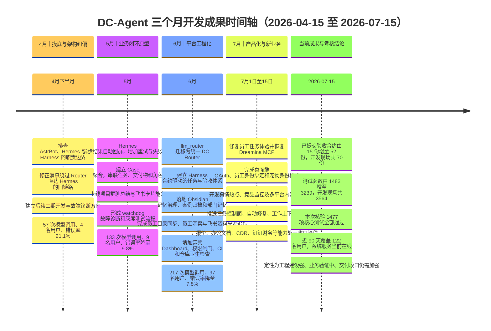

# DC-Agent 三个月开发成果时间轴

## 可编辑 Mermaid 版本

```mermaid
---
config:
  theme: base
  timeline:
    disableMulticolor: false
---
timeline
    title DC-Agent 三个月开发成果时间轴（2026-04-15 至 2026-07-15）

    section 4月｜摸底与架构纠偏
        4月下半月 : 排查 AstrBot、Hermes 与 Harness 的职责边界
                   : 修正消息绕过 Router 直达 Hermes 的旧链路
                   : 建立后续二期开发与故障诊断方向
                   : 57 次模型调用、4 名用户、错误率 21.1%

    section 5月｜业务闭环原型
        5月 : Hermes 异步结果自动回群，增加重试与失败兜底
            : 建立 Case 聚合，串联任务、交付物和角色
            : 上线项目群聊总结与飞书卡片能力
            : 形成 watchdog 故障诊断和灰度测试流程
            : 133 次模型调用、9 名用户、错误率降至 9.8%

    section 6月｜平台工程化
        6月 : llm_router 迁移为统一 DC Router
            : 建立 Harness 合约驱动的任务与验收体系
            : 落地 Obsidian 记忆治理、案例归档和部门记忆
            : 完成员工目录同步、员工洞察与飞书资料来源追踪
            : 增加运营 Dashboard、权限闸门、CI 和仓库卫生检查
            : 217 次模型调用、97 名用户、错误率降至 7.8%

    section 7月｜产品化与新业务
        7月1日至15日 : 修复员工任务体验并恢复 Dreamina MCP
                    : 完成桌面端 OAuth、员工身份绑定和宠物身份校验
                    : 开发舆情热点、竞品监控及多平台内容采集
                    : 推进任务控制面、自动修复、工作上下文账本
                    : 报价、办公文档、CDR、钉钉财务等能力处于收口阶段

    section 当前成果与考核结论
        2026-07-15 : 已提交验收合约由 15 份增至 52 份，开发现场共 70 份
                   : 测试函数由 1483 增至 3239，开发现场共 3564
                   : 本次核验 1477 项核心测试全部通过
                   : 近 90 天覆盖 122 名用户，系统服务当前在线
                   : 定性为工程建设强、业务验证中、交付收口仍需加强
```

## 状态说明

- 4月至6月主体能力已有当前代码和测试支撑。
- 7月舆情、任务控制面、报价及办公工具中，部分仍位于功能分支或未提交工作区。
- 使用人数采用本地运行数据库中 `conversations.user_id` 的去重口径。
