# 员工发票额度台账完整流程图

```mermaid
%%{init: {"theme": "base", "flowchart": {"curve": "basis", "nodeSpacing": 32, "rankSpacing": 44}}}%%
flowchart TB
    subgraph OA ["一、员工提交与 OA 建单"]
        A0(["开始报销"]) --> A1["选择员工、部门、项目和费用科目"]
        A1 --> A2["填写报销金额、事由和收款信息"]
        A2 --> A3["上传发票附件，可不上传"]
        A3 --> A4["提交 OA 报销审批"]
        A4 --> A5["OA 生成唯一流水号和审批实例"]
    end

    subgraph BOT ["二、机器人实时审核"]
        B0["接收 OA 提交事件"] --> B1{"OA 流水号和事件版本是否已处理？"}
        B1 -->|"是"| B2["返回已有处理结果，不重复记账"]
        B1 -->|"否"| B3["读取申请人、金额、项目、科目、附件和审批链接"]
        B3 --> B4{"必填字段是否完整？"}
        B4 -->|"否"| BX1["登记资料缺失异常并通知补充"]
        B4 -->|"是"| B5{"是否存在发票附件？"}
        B5 -->|"否"| B6["有效发票金额记为 0 元"]
        B5 -->|"是"| B7["下载附件并执行 OCR 识别"]
        B7 --> B8["提取发票号码、金额、抬头、税号、日期和销售方"]
        B8 --> B9["执行验真、查重、红冲作废、抬头和归属校验"]
        B9 --> B10{"发票是否全部有效且可归属？"}
        B10 -->|"否或无法确定"| BX2["登记发票异常并转财务人工复核"]
        B10 -->|"是"| B11["汇总本次有效发票金额"]
        B6 --> B12["计算额度差额"]
        B11 --> B12
        B12 --> B13["额度缺口 = max 报销金额减有效发票金额, 0"]
        B13 --> B14["待入额度 = max 有效发票金额减报销金额, 0"]
    end

    subgraph ACCOUNT ["三、额度后台记账与并发控制"]
        C0["以员工 ID 锁定额度账户并开启事务"] --> C1["读取可用额度、冻结额度和当前版本"]
        C1 --> C2{"本次存在额度缺口？"}
        C2 -->|"是"| C3{"员工可用额度是否足够？"}
        C3 -->|"否"| CX1["登记额度不足异常，不自动扣减"]
        C3 -->|"是"| C4["冻结缺口金额，可用额度同步减少"]
        C4 --> C5["生成待扣减流水"]
        C2 -->|"否"| C6{"本次存在待入额度？"}
        C6 -->|"是"| C7["生成待入额流水，暂不增加可用额度"]
        C6 -->|"否"| C8["生成零变动审计流水"]
        C5 --> C9["登记发票分配关系和 OA 关联关系"]
        C7 --> C9
        C8 --> C9
        C9 --> C10["写入处理前余额、处理后预计余额和幂等键"]
        C10 --> C11["提交数据库事务"]
    end

    subgraph BITABLE ["四、飞书多维表格联动"]
        D0["机器人同步本次处理结果"] --> D1["员工额度账户表：更新可用、冻结、待入和已使用额度"]
        D0 --> D2["额度流水表：追加 OA 流水、方向、金额和状态"]
        D0 --> D3["发票明细表：更新验真、归属、占用和剩余金额"]
        D0 --> D4["异常处理表：记录资料、发票或额度异常"]
        D1 --> D5["生成本次台账记录链接"]
        D2 --> D5
        D3 --> D5
        D4 --> D5
    end

    subgraph NOTICE ["五、通知与 OA 审批"]
        E0["发送飞书卡片给财务和员工"] --> E1["展示员工、报销金额、有效票额、额度变化和 OA 流水号"]
        E1 --> E2["附 OA 审批链接和多维表格台账链接"]
        E2 --> E3{"OA 后续状态"}
        E3 -->|"审批中"| E4["保持额度冻结或待入额状态"]
        E4 --> E3
        E3 -->|"退回修改"| E5["冲销本版本待处理记录并释放冻结额度"]
        E5 --> E6["员工修改金额或附件后重新提交新版本"]
        E3 -->|"驳回或撤回"| E7["释放冻结额度并取消待入额度"]
        E3 -->|"审批通过"| E8{"是否已完成付款或财务确认？"}
        E8 -->|"否"| E9["保持待结算状态并等待付款事件"]
        E9 --> E8
        E8 -->|"是"| E10["进入正式结算"]
    end

    subgraph SETTLE ["六、正式结算、回写与归档"]
        F0["再次锁定员工额度账户"] --> F1{"原流水变动类型"}
        F1 -->|"待扣减"| F2["冻结额度转为正式已使用额度"]
        F1 -->|"待入额"| F3["待入额度转为员工可用额度"]
        F1 -->|"零变动"| F4["关闭审计流水，不改变余额"]
        F2 --> F5["追加已生效结算流水"]
        F3 --> F5
        F4 --> F5
        F5 --> F6["回写数据库和四张多维表格"]
        F6 --> F7["通知财务和员工最终余额及 OA 流水号"]
        F7 --> F8["归档发票、审批、通知和全部审计记录"]
        F8 --> F9(["本次报销处理完成"])
    end

    subgraph EXCEPTION ["七、异常与事后冲正"]
        X0["财务在异常处理表收到待办"] --> X1{"人工处理结论"}
        X1 -->|"补充或更换发票"| X2["员工补充资料并重新触发审核"]
        X1 -->|"按无票场景处理"| X3["经财务确认后按全额缺口计算"]
        X1 -->|"拒绝报销"| X4["终止自动记账并通知 OA 审批人"]
        X1 -->|"额度不足特批"| X5["记录授权人和特殊处理意见"]
        X5 --> X6["按财务确认金额生成待处理流水"]
        X7["结算后发生红冲、作废、退款或记账错误"] --> X8["创建冲正申请，不删除原流水"]
        X8 --> X9["财务审批冲正"]
        X9 --> X10["追加反向流水并更新额度、发票和多维表格"]
        X10 --> X11["通知相关员工和财务并保留完整审计链"]
    end

    A5 --> B0
    B14 --> C0
    C11 --> D0
    D5 --> E0
    E6 --> B0
    E7 --> G0["追加释放流水并同步多维表格"]
    G0 --> G1(["流程关闭"])
    E10 --> F0

    BX1 --> D0
    BX2 --> D0
    CX1 --> D0
    BX1 --> X0
    BX2 --> X0
    CX1 --> X0
    X2 --> B0
    X3 --> B6
    X4 --> G1
    X6 --> C9
    F9 -.->|"出现事后异常"| X7

    classDef startEnd fill:#E8F3FF,stroke:#3370FF,stroke-width:2px,color:#1F2329;
    classDef process fill:#F5F7FA,stroke:#8F959E,stroke-width:1.2px,color:#1F2329;
    classDef decision fill:#FFF7E6,stroke:#D46B08,stroke-width:1.5px,color:#1F2329;
    classDef ledger fill:#F0F9EB,stroke:#389E0D,stroke-width:1.5px,color:#1F2329;
    classDef bitable fill:#E6FFFB,stroke:#08979C,stroke-width:1.5px,color:#1F2329;
    classDef exception fill:#FFF1F0,stroke:#CF1322,stroke-width:1.5px,color:#1F2329;
    classDef notice fill:#F3F0FF,stroke:#722ED1,stroke-width:1.5px,color:#1F2329;

    class A0,F9,G1 startEnd;
    class B1,B4,B5,B10,C2,C3,C6,E3,E8,F1,X1 decision;
    class C0,C1,C4,C5,C7,C8,C9,C10,C11,F0,F2,F3,F4,F5,F6 ledger;
    class D0,D1,D2,D3,D4,D5 bitable;
    class BX1,BX2,CX1,X0,X2,X3,X4,X5,X6,X7,X8,X9,X10,X11 exception;
    class E0,E1,E2,E4,E5,E6,E7,E9,E10,F7,F8 notice;
```

## 图中统一口径

- `额度缺口 = max(报销金额 - 有效发票金额, 0)`。
- `待入额度 = max(有效发票金额 - 报销金额, 0)`。
- OA 提交时只冻结额度或登记待入额；审批通过并完成付款后才正式生效。
- OA 流水号、员工 ID 和事件版本共同组成幂等标识，重复事件不重复记账。
- 多维表格是财务查看、筛选和复核界面，后台数据库负责余额事务和并发一致性。
- 所有修改通过追加结算、释放或冲正流水实现，不删除原始流水。
